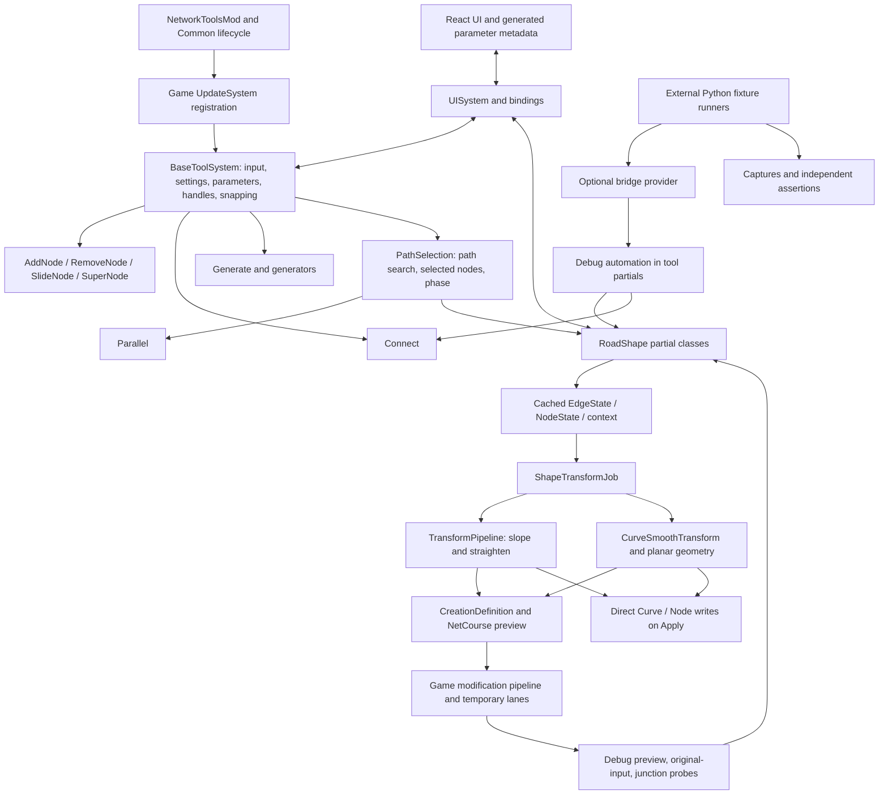
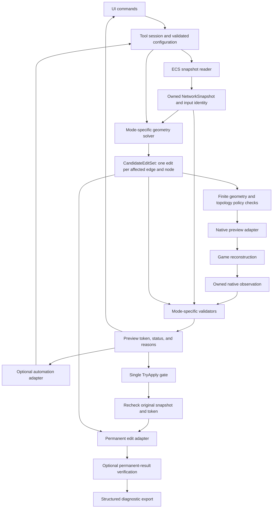
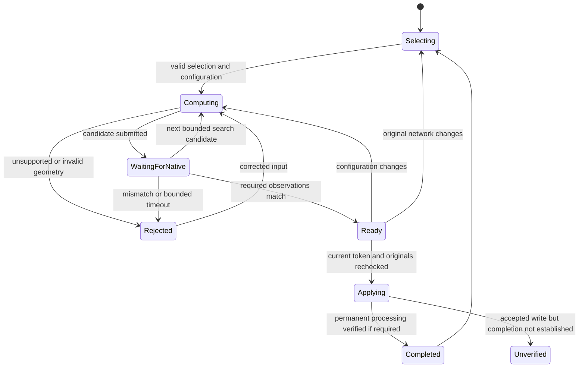
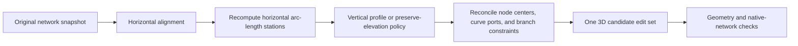
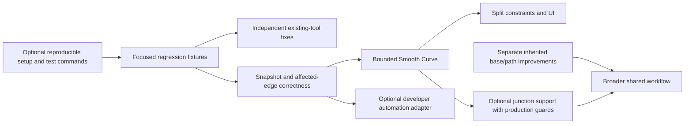

# Network Tools: code and architecture review

Date: 2026-10-01. Review type: static, read-only; this report is the only requested write. No build, test, game operation, checkout, fetch, commit, or source modification was performed for this review.

## 1. Assessment

The project has a sound foundation worth preserving: game-native tool systems, explicit job configuration, shared selection and interaction infrastructure, declarative parameters, generated UI metadata, and increasingly isolated geometry. The fork has made meaningful improvements to both behavior and the ability to investigate failures.

The main architectural weakness is the contract between **the original network, the proposed edit, the native preview, and the permanent result**. These are four different things, but ownership and validity are spread across mutable fields in tool partial classes. Adding another boolean or probe can protect one path while leaving another path with different guarantees. This is more consequential than the number of files or the use of partial classes.

I recommend incremental extraction around those contracts, not replacement of Luca's tool framework. The first upstream contribution should be substantially smaller than the fork's complete history. It should include the fixes, feature implementation, and regression fixtures needed to support a clearly bounded behavior. Experimental junction search and its essential validation must either travel together or remain explicitly unavailable.

The inherited architecture deserves changes too. In particular, path-search state, aggregation of side-edge edits, parameter validation, and ownership of temporarily disabled game systems are independent upstream improvements. They should not be presented as regressions introduced by this fork.

### Highest priorities

1. Close the Release/Debug gap before offering Smooth Curve as a generally supported feature.
2. Tie freshness checks to the exact source snapshot used to calculate a candidate.
3. Build one edit per affected edge, including both endpoints of unselected side edges.
4. Make failed regression suites fail their process, and make reported preservation checks actual assertions.
5. Introduce a shared, typed preview/Apply validity contract before adding more automation commands or combined curve/slope behavior.

## 2. Baselines, scope, and confidence

| Item | Reviewed baseline |
|---|---|
| Luca upstream `main` | `7d1f3d0e18d43abb7747c5437138d7fa74655748` |
| Fork `origin/main` | `ed3ab81fa71a94a9474ac5eb4cebcf6acde6c20f` |
| Read-only source location for current main | Sibling `nt-history-review`, HEAD `03e956afbabe43165e5f7be185a28aca20bd1563`; its tracked tree was verified equal to `ed3ab81` |
| Destination checkout | `CS2-NetworkTools`, HEAD `f3998ae6d26e4a6cf2106c95ec3e19c3370b9386`; this is where the user requested reports, not the implementation baseline |
| Active development excluded from conclusions | `nt-terrain-profile`, observed at `b122cb639466b2499f9423fc900b2970be3da891`; unmerged work may already address some findings |
| Game source consulted | Local decompile manifest: CS2 `1.6.2f1 (767.21d1) [6300.26419]`; used to check the `Game.Net.Node` data contract |

Remote branch tips were checked with read-only `ls-remote`; existing local objects and worktrees supplied the source. A different commit ID in the review worktree does not imply different tracked content. Future changes on any branch need separate review.

This is a repository-wide architectural survey with deeper code review of the fork delta, RoadShape, selection, parameters, preview/Apply, job ownership, UI integration, and verification tooling. The other tool families, rendering, settings, prefab creation, build, and shared infrastructure were surveyed for roles and integration patterns. This is not a claim that every line, every inherited algorithm, or every game lifecycle interleaving has been exhaustively verified. Common is a pinned, unchanged submodule; its public role and build integration are in scope, but a full independent review of its internals is not.

Evidence labels used below:

- **Confirmed source issue:** the control/data flow establishes the issue; no new live reproduction is claimed.
- **Conditional correctness risk:** a concrete scenario can exercise the problematic flow, but the full game outcome needs a fixture.
- **Design recommendation:** a maintainability or extensibility improvement, not a demonstrated failure.

Prior test and session records provide context, not fresh execution evidence. See the [test and documentation audit](test-coverage-audit-2026-10-01-nt-f3998ae6-bridge-e7979207.md) for the detailed coverage assessment. The CS2 modding and UI skills were used as review guidance; source takes precedence over general guidance.

## 3. Size and ownership of the upstream delta

`git diff --numstat 7d1f3d0 ed3ab81`, grouped by path:

| Group | Changed files | Added text lines | Removed text lines |
|---|---:|---:|---:|
| Mod source/UI/localization, including Debug instrumentation | 51 | 2,169 | 63 |
| C# test projects and fixtures | 16 | 994 | 0 |
| Scripts and fixtures | 65 | 4,294 | 0 |
| Living documentation | 21 | 2,818 | 0 |
| Session notes, captures, and plots | 193 | 237,466 | 0 |
| Root setup and documentation | 4 | 415 | 1 |
| **Total** | **350** | **248,156** | **64** |

Binary files count toward file totals but not text-line totals. These are diff lines, not executable-code counts. About 95.7% of added text is session evidence. This is primarily a packaging problem, not evidence that the implementation needs a sweeping reduction.

The tracked C#/TypeScript/TSX/SCSS inventory is 258 files and 32,037 lines, excluding Common contents but including declaration files and tests. Large inherited areas include `BaseToolSystem.Handles.cs` (1,340 lines), `.Snap.cs` (1,313), `BaseToolSystem.cs` (971), and Codegen `Program.cs` (732). RoadShape has 29 files in its tool subtree; its job file is 620 lines. Line counts identify reading/ownership burdens, not defects by themselves.

The fork did not change Common, Base, PathSelection, or Codegen in this comparison. New Smooth Curve geometry, split points, Debug validation/automation, RoadShape consistency fixes, prefab-default changes, and editor binding changes are the principal implementation additions.

### Coordination required before deciding the fate of Debug code

At Dan's request, **Debug-only must not be treated as synonymous with disposable diagnostics or functionality that should stay downstream**. It can contain intended production functionality awaiting qualification or extraction. The implementing agent's intent and active work must be reconciled before changing scope or removing any such code.

The other working agent was not reachable through this session's agent registry, so no direct confirmation has been obtained. A read-only check of its active-worktree notes found concrete supporting context: `nt-terrain-profile/NetworkTools.docs/session-notes/2026-10-01-0552-profile-repeatability.md`, under “Bounded native preview feedback,” explicitly says that the experimental surface correction is Debug-only because its gate depends on the Debug native observation infrastructure. The later “Native preview settling passed” entry records accepted settling and repeat-operation results; Release/Burst is still not qualified in that record. These are the other agent's recorded results, not independently rerun results or part of the reviewed main baseline.

Before implementing this report's packaging recommendations, obtain answers from that agent:

1. Which `IS_DEBUG` blocks are intended player features, required correctness gates, optional automation, and temporary diagnostics?
2. Which of those have newer implementations on the active branch, and which findings here are already addressed there?
3. What dependencies must move together when promoting a feature—snapshot capture, native observer, Apply gate, fallback behavior, and UI status?
4. What qualification remains: Release compilation/Burst, native cases, persistence, performance, unsupported-selection rejection, and compatibility?
5. What is the intended first upstream feature envelope after that work is merged?

Until those answers are available, the exclusion/promotion choices in sections 5 and 8 are **provisional architecture options**, not a recommendation to discard the other agent's functionality. F01 remains a finding about the reviewed main build configurations, not a judgment that Debug placement was accidental or unjustified.

## 4. Architecture as it is now

The diagram summarizes dependencies, not exact scheduling. Registration explicitly places the Debug observer after `ModificationEndBarrier`; job completion and native network reconstruction remain separate events. See [registration][registration], [RoadShape scheduling][schedule], and [preview observation][probe].

### Good boundaries to keep

- **Game systems own game integration.** The framework fits the native tool lifecycle; a separate application framework or dependency-injection container would add little here.
- **Configuration snapshots cross into jobs.** `ShapeJobConfig`, `ConnectJobConfig`, and `GenerateJobConfig` are preferable to reading mutable parameter objects from worker jobs.
- **Pure horizontal geometry is separate from ECS.** Path, split, and junction targets consume coordinates and caller-owned buffers. Reversed traversal is handled in the adapter. Float conversion is checked before results are published. This is a real improvement from the fork, not just directory organization. [Geometry adapter][curve]
- **One parameter declaration feeds several consumers.** UI metadata, persistence, handles, and bindings already share a schema. Strengthen that boundary rather than inventing an unrelated automation parameter model.
- **Small capability interfaces help UI code.** `IManualApplyProvider`, `INodeSelectionProvider`, and `IToolPrefabProvider` avoid forcing every tool to implement every operation.
- **Automation reuses tool behavior.** The optional provider does not introduce a bridge assembly dependency or a parallel geometry implementation. Keep transport permissions and fixture orchestration outside the mod.
- **Native validation is treated as empirical.** The code and investigation notes acknowledge that repeated observations are not a formal universal rebuild fence. Preserve that honesty in the shipped contract.

### Where boundaries are weak

The base class combines several independently changing responsibilities; partial files improve navigation but share all state. RoadShape adds candidate search, observation, JSON, revisions, cached inputs, diagnostics, and automation to the same stateful object. Connect then implements a second observation protocol using serialized snapshots, while RoadShape uses boxed typed snapshots. UI and automation do not have the same Apply requirements.

The geometry folder also mixes numerical kernels with managed search/observation helpers, and its fundamental point type is nested in the legacy `PlanarFairing` algorithm. None of this requires a new DLL. It does warrant clearer ownership and names.

## 5. Review findings

Priority meanings: **P1** should be resolved or explicitly excluded before shipping the affected feature; **P2** is a focused correctness/maintenance improvement; **P3** is cleanup or a later architectural improvement. Priorities are review recommendations, not measured user-impact frequencies.

### F01 — Smooth Curve is exposed in Release without the Debug junction safeguards

**P1 · Fork · Confirmed configuration/contract gap.**

`CurveSmooth` is enabled in the template metadata. `SmoothPreviewResult` calls `JunctionSearchAllowsApply()` only under `IS_DEBUG`. Both search implementations and the native observer are also Debug-only. Release can therefore approve a successful planar fit without the connection-preservation checks used to establish confidence in Debug. Interior pinned junctions generally reject through the geometry contract in Release; endpoint junctions are not equivalently excluded, and preserving an endpoint or tangent does not establish preserved native lane connectivity. [Template][template], [Apply gate][applygate], [endpoint search][endpoint], [interior search][interior]

**Recommendation:** explicitly declare the supported Release selection envelope. For a small first feature PR, reject unsupported endpoint/interior junction cases and explain why in the UI. Alternatively, move the required observer and validators into production code and keep only tracing, experimental search, and the bridge adapter Debug-only. Do not remove diagnostic files wholesale until their safety responsibilities have been separated. Required verification: Release build/Burst and the same allowed/rejected topology cases through the ordinary UI.

### F02 — Freshness is not tied to the snapshot that actually feeds the transform

**P1 · Inherited cache design + fork observation layer · Conditional correctness risk, established source mismatch.**

`RefreshPathData()` caches geometry on path-ready/extended/trimmed events. A later parameter change marks the preview dirty without necessarily refreshing that cache. Scheduling captures **current ECS components** into `m_SubmittedOriginalInputs`, but the transform consumes **cached** `m_EdgeStates`, `m_NodeStates`, and context. The resulting freshness comparison proves that ECS has not changed since submission, not that those are the components from which the candidate was computed. [Cache refresh][cache], [selection callbacks][shapetool], [scheduling][schedule], [original probe][original]

Concrete sequence: select at state A; another system changes a selected curve to B; change strength; capture B as the submission baseline while fitting cached A. If native output matches that candidate, the probe can accept B-to-B freshness although the edit was computed from A. This is separate from the already-protected case where originals change *after* submission.

**Recommendation:** gather geometry and the comparison baseline as one owned `NetworkSnapshot`, or compare current inputs with the cache's baseline before generating a new candidate and rebuild/reject on change. Include incident edges and relevant optional component presence. Add tests for changes before submission, during reconstruction, and before Apply. Pausing simulation reduces activity but does not establish exclusive ownership of the ECS world.

### F03 — Two moved selected nodes can produce competing writes to one unselected edge

**P1 · Inherited · Confirmed algorithmic issue for the described topology; live outcome untested here.**

RoadShape deduplicates nodes, not affected edges. If an unselected edge connects two nodes that both move, `AdjustConnectedEdgeAtNode()` is called twice. Each call reads the original `CurveLookup` value and queues a whole `Curve` replacement. The second replacement loses the first endpoint's adjustment. The preview side similarly emits an independent definition for each endpoint of that same edge. [Preview output][previewoutput], [Apply output][applyoutput]

Example: the selection follows a multi-edge route from A to B while a longer direct A–B side edge remains outside the selection. Slope moves both interior path nodes A and B. One queued side-edge curve changes its start, and another changes its end; neither contains both changes. Smooth Curve's junction pinning limits exposure in that mode, but does not fix the shared writer for slope/straighten.

**Recommendation:** assemble one candidate record per affected edge, combine endpoint deltas, then emit it once through each output adapter. A fixture needs a side edge with both endpoints in the selected node set, both deltas nonzero and different, plus reversed storage. This is a valuable standalone upstream correction.

### F04 — Path-search state omits information used by its transition cost

**P2 · Inherited · Confirmed algorithmic issue.**

The Dijkstra search marks a node visited once, but the cost of leaving that node depends on the prefab of the arriving edge. Therefore the state is not just `node`; it includes the incoming prefab or edge. [Path search][pathsearch]

Counterexample: reach node J at accumulated cost 10 on prefab A, or cost 11 on prefab B. The final B edge has length 1. The implementation settles the cost-10 arrival and pays the 9.9 prefab-change penalty: 20.9. The discarded cost-11 arrival would total 12. The claim of finding the lowest-cost route under this cost function is false for this case.

**Recommendation:** use a state key such as `(node, incomingPrefab)` and reconstruct parents by that state, with an explicit start sentinel. Preserve the no-immediate-backtracking behavior, or model incoming edge if that restriction remains significant. A simpler alternative is an edge-only cost, if that is the intended UX. First add a small graph fixture with this counterexample and tie cases. Also bound full-network eligibility/search work or profile large-city selections before expanding its use; current traversal is synchronous.

### F05 — Regression-suite failures need not produce a failing suite exit code

**P1 for automated acceptance · Fork · Confirmed source issue.**

`run-provider-suite.py` records failed child exit codes and prints `FAIL`, but continues when a report exists and eventually returns normally. It raises only for incomplete execution or lifecycle failure. A suite of completed assertion failures can therefore exit zero. [Suite runner][suite]

**Recommendation:** preserve the useful distinction between a diagnosable failed assertion and an uncertain mutation, continue only where currently safe, then return nonzero if any case failed. The summary should distinguish passed, assertion-failed, execution-incomplete, and not-run. Add a no-game orchestration test with a fake child result; no real bridge is required to test exit aggregation.

### F06 — Connect smoke-test reports preservation without requiring it

**P2 · Fork · Confirmed source issue.**

`exercise-tool-provider.py` computes `unchangedExistingEdges`, but its final Connect assertion does not check that field. It can succeed with altered existing edges if connectivity, inherited prefab, new-edge presence, and the preview error threshold pass. Its geometric matching also needs explicit one-to-one coverage to serve as a comprehensive equality check. [Smoke assertions][smoke]

**Recommendation:** make every promised preservation invariant an assertion and require unique coverage of both expected and actual new edges. Keep slope lane snapshots labeled diagnostic until semantic transitions are actually asserted. The larger live runner has stronger checks; extract reusable assertion helpers rather than treating the small smoke runner as an equivalent gate.

### F07 — Global game-system overrides are restored without ownership

**P2 · Inherited, with expanded fork use · Confirmed source behavior; compatibility impact conditional.**

Base tool stop/destroy unconditionally enables validation, node reduction, and course splitting. It does not restore prior state or restrict restoration to switches that this activation changed. The fork additionally disables node reduction for RoadShape to keep preview topology consistent. That is a reasonable local fix, but extends reliance on the inherited global override behavior. [Base lifecycle][base], [RoadShape lifecycle][lifecycle]

**Recommendation:** give the active tool session an explicit override owner. Track which switches it changes and their previous values; centralize transitions among NT tools. Restoring a saved boolean alone is not enough if another mod changes the same global setting while NT holds it, so document the cooperation limitation and test tool switching. This should be a focused upstream lifecycle change rather than hidden inside Smooth Curve cleanup.

### F08 — UI parameter ranges are metadata, not a domain invariant

**P2 · Inherited + duplicated fork checks · Confirmed boundary weakness.**

`Parameter<T>.SetValue()` performs equality checking but no validation. Float/int ranges are stored in metadata. UI callbacks assign values directly; persisted values use conversion rather than range enforcement. The new automation code separately checks numeric types, finiteness, and ranges. This yields different accepted domains depending on the caller. [Parameter core][parameter], [UI binding][uibinding], [automation][automation]

This matters beyond malformed UI messages: configuration loaded from older versions or programmatic assignments can bypass the slider. For example, GridGenerator assumes positive grid dimensions when writing `xOffsets[0]`/`zOffsets[0]` and valid alternation divisors. This review did not inject invalid values into the game.

**Recommendation:** add typed validation at the parameter/configuration boundary, shared by UI, persistence, and automation. Reject non-finite values. Decide explicitly whether out-of-range persisted values clamp with a diagnostic or reset to defaults. Validate a multi-parameter request before mutation, then publish it as one logical revision; the slope automation already validates the request before writing and is a useful starting point.

### F09 — Apply validity is spread across callers and mode-specific booleans

**P1/P2 depending on shipped mode · Interaction · Confirmed contract divergence.**

Manual RoadShape `CanApply` requires a completed valid result for Smooth Curve, but accepts other non-Preserve modes based on phase. Automation adds revision/submission matching, native preview observation, and original-input checks. Thus an automation test can pass under stricter preconditions than a user's Apply path. The two paths do ultimately share `RequestApply`, but that method does not carry all the automation preconditions. [Apply gate][applygate], [automation][automation]

**Recommendation:** one domain-level `TryApply(expectedToken)` performs the applicable validity checks for all entry points. UI can supply the current token internally; it need not expose revision jargon to users. Transport authorization remains outside this function. Define mode-specific validation policies explicitly: geometric validity, freshness, native correspondence, topology, and lane preservation are different guarantees.

### F10 — Direct Node replacement discards the original rotation field

**P2 · Inherited · Confirmed write; downstream effect requires verification.**

`OutputApply` writes `new Node { m_Position = newPosition }`, including for unchanged endpoint positions. The installed-version `Game.Net.Node` also contains `m_Rotation`, so this writes the default quaternion rather than preserving the previous rotation. This review does not establish whether a subsequent native system consistently reconstructs the desired rotation before every consumer runs. [Node write][applyoutput]; local game source `cs2-decompile/src/Game/Game.Net/Node.cs:9`.

**Recommendation:** preserve other component fields when changing position, or explicitly derive rotation if that is required by the native contract. Add a before/after test for position-preserving operations and rotated junctions. Do not classify this as proven visible corruption without tracing the downstream rebuild.

### F11 — Candidate-search history can affect the chosen geometry

**P2 design decision · Fork · Confirmed selection policy, not proven harmful.**

Interior search remembers an accepted angle keyed by original inputs and node split/pin state. Strength is intentionally not part of that key. On the next strength change it tries that remembered angle before zero and accepts the first passing candidate. The same final input strength can therefore select different valid candidates depending on slider history, if more than one candidate passes. [Search ordering][searchorder], [interior search][interior]

**Recommendation:** choose and document the objective. If canonical minimum-rotation output is required, warm starts may accelerate observation but must not change the final ranking. If interactive continuity is the objective, represent the prior accepted candidate as explicit session state and test hysteresis/history behavior. Connectivity acceptance alone is not a curve-quality objective. Keep bounded search; do not promise that a common +/-15-degree rotation solves arbitrary junction constraints.

### F12 — Observer work is expensive and its statuses are difficult to interpret

**P2/P3 · Fork · Confirmed work pattern, performance not measured here.**

Probes repeatedly enumerate temporary edges, build dictionaries/sets, inspect lane buffers, compare boxed component lists, and sometimes serialize full state. Endpoint and interior observers have separate lifecycle counters and partly duplicated connectivity readers. `SplitChoicesJson()` also constructs JSON and completes the last shape job from the per-update UI binding path. The new defensive `Complete()` calls address real lifetime risks; removing them without replacing ownership would regress correctness. [Preview probe][probe], [interior search][interior], [split UI data][splits], [UI update][uiupdate]

**Recommendation:** first instrument input-gather time, job time, native-wait time, observer time, attempts, and allocation volume separately. Cache split-choice presentation by selection/split revision. Read temporary-edge ownership once per relevant observation and share that snapshot among validators. Use typed status enums and reasons, including unsupported, waiting, invalid geometry, changed inputs, ambiguous preview, and exhausted search. Reduce synchronization only after proving container lifetime and dependency ownership.

### F13 — Code generation silently tolerates unsupported declarations

**P2/P3 · Inherited · Confirmed behavior, no current wrong output established.**

The Roslyn syntax-based generator is a useful design, but it is not semantic compilation. It parses without configured preprocessor symbols, warns and emits an empty result if no parameters are found, and some unresolved expressions fall back to zero. This can turn future declaration changes into valid-looking but incorrect UI metadata. [Codegen][codegen]

**Recommendation:** retain the small generator, explicitly define its accepted declaration subset, and fail with file/line diagnostics on unsupported expressions, duplicate keys, or unexpected empty output. Add golden fixtures for current parameter styles and configuration-dependent enum options. A full source-generator framework is optional, not a prerequisite. The `--configuration` argument after `--` is intentionally consumed by this program; it should not be reported as a missing application argument.

### F14 — Build and test entry points do not express independent stages

**P2 · Inherited build coupling + fork bootstrap · Confirmed workflow issue.**

Building normally includes UI generation/build, postprocessing, and local deployment. npm's prebuild performs `npm install`; the bootstrap `-Test` path builds/deploys and invokes the legacy test project rather than the complete newer test suite. A reviewer cannot assume “test” is isolated or comprehensive. [Project][project], [npm scripts][npm], [bootstrap][bootstrap]

**Recommendation:** expose explicit offline-test, compile, package, deploy-local, and live-regression commands. Reuse underlying MSBuild targets rather than replacing the entire build system. Use a reproducible dependency-install step and keep publishing explicitly separate. Preserve the bootstrap's user-scoped environment handling and postprocessor troubleshooting. These are valuable setup improvements, but do not put personal machine paths or security-policy changes into upstream defaults.

### F15 — Presentation and source organization still reveal the experimental workflow

**P3 · Mostly fork · Confirmed cleanup opportunities.**

The two injection tooltips include `[Dan local]`. The split UI uses localization fallbacks but its new keys need inclusion in the canonical localization workflow. `ProviderV1` and `VectorJsonConverter` live under RoadShape even though the provider handles Connect too. Several geometry/search methods are densely compressed, and foundational `Point` is nested under legacy `PlanarFairing`. Debug-only self-check experiments occur inside `OriginalProbeStatus()` rather than solely in a test harness. [Split controls][splitui], [provider][provider], [original probe][original]

**Recommendation:** remove the fork marker from the proposed upstream diff; finish localization; move the protocol adapter to a clearly named optional automation area; give geometry primitives neutral names; format touched mathematical/control-flow code for review. Move copy-corruption self-checks into offline tests after preserving their intent. Do not confuse these relatively small cleanups with the higher-priority snapshot and Apply contracts.

## 6. Repository-wide architecture assessment

| Area | Inherited design and fork contribution | Recommendation |
|---|---|---|
| Mod lifecycle and system registration | Common-backed lifecycle, explicit game phases; fork adds post-modification observer | Keep. Document the dependency/order contract next to observer registration. Avoid static state becoming cross-world state. |
| Base tool, handles, snapping | Rich inherited framework; several thousand lines share one object | Retain public behavior. Extract ownership of overrides and handle sessions before considering larger composition. Avoid a base-class rewrite in the feature PR. |
| PathSelection | Reused by RoadShape/Parallel; weighted graph search and phase callbacks | Fix the state key independently. Separate graph search from ECS reads enough to test it on small graphs. Bound or measure synchronous traversal. |
| Add/Remove/Slide/SuperNode | Existing native definition jobs, terrain/render dependencies, topology-changing operations | Keep distinct from topology-preserving reshape. Characterize native preview/Apply and cancellation before generalizing a shared operation engine. Do not imply new live coverage for these tools. |
| Connect | Existing curve configuration and definition output; fork adds nullable inherited prefab selection and Debug control | Keep generator/definition design. Share validity/result vocabulary with RoadShape, not the numerical algorithm or every state field. Start automation tests with documented SimpleCurve scope. |
| Parallel | Existing path-offset implementation; fork inherits prefab independently for each source edge | Good focused change. Test mixed-prefab paths, reverse direction, explicit overrides, and native lane prefabs. Do not collapse per-edge inheritance back into one tool-level fallback. |
| Generate | Existing generator strategies and `EdgeConfig` output, grid/oval variants | Good separation worth keeping. Enforce config invariants. Move genuinely shared elevation policy out of RoadShape ownership only when its meaning is identical. |
| RoadShape | Cached path/context, generic transform pipeline; fork bypasses pipeline for joint curve/node fitting | Bypass is justified: a joint fit cannot be modeled honestly as independent edge transforms followed by node averaging. Share a candidate/result interface, not a misleading universal per-edge algorithm. |
| Numerical geometry | New pointer kernels, managed wrappers/tests, structured failures | Preserve game independence and caller-owned scratch. Extract neutral point/vector types, clarify units and aliasing requirements, and document split versus junction constraints. |
| Native preview/Apply | Existing two different output mechanisms; fork adds topology/height consistency fixes and observers | Highest-value extraction: one affected-network edit set, two adapters, explicit observations and preconditions. Equality must be tested across the native pipeline. |
| Rendering/tooltips | Existing overlay systems and metadata consumers | Keep presentation downstream of tool state. Slope metadata currently uses endpoint rise divided by curve length: label this precisely; it is neither peak grade nor generally rise over horizontal distance. Do not substitute it for grade constraints. |
| Parameters/settings | Existing reflection schema, persistence, event-driven handle propagation | Central validation and batched logical updates; retain equality guards and change-origin semantics. Test cycle/propagation behavior before altering event order. |
| React UI/bindings | Existing shared controls and generated parameter bindings; fork fixes editor panel state and adds splits | Keep one authoritative panel state. Bind typed split data rather than JSON-in-string when practical. Explain disabled Apply and unsupported selections in player language. |
| Localization/assets | Existing source dictionary and localization files; small fork additions | Finish keys and remove local branding from upstream candidate. Preserve upstream attribution/assets. |
| Codegen | Existing standalone syntax generator | Harden diagnostics and add representative generation tests. Do not manually maintain generated parameter output. |
| Build/package | Common imports and game SDK, Release/Burst distinct from Debug | Separate execution stages, test configurations explicitly, retain pinned Common. Confirm packaging/version identity before any eventual publication. |
| Automation and diagnostics | Fork reflection protocol plus independent bridge and Python workflows | Keep optional adapter; move core validity out of it. Share data contracts and assertion helpers, not permissions or transport plumbing inside geometry. |
| Tests and research | Fork adds substantial offline and live evidence, but uneven coverage and archived failures | Keep focused fixtures and reproducible harnesses upstream. Store raw investigative captures separately; retain evidence links and explicit known failures. |

For the inherited base, a sensible longer-term use of **composition** is to give a tool owned collaborators such as a handle session and a game-system override session. That means separately owned responsibilities, not replacing `ToolBaseSystem` inheritance. The current small capability interfaces and strategy structs are already useful patterns.

## 7. Proposed architecture

### 7.1 First target: explicit candidate ownership within the existing assembly

These are responsibility boundaries, not a requirement for twelve classes, public interfaces, or separate projects. Start with small internal structs/helpers. Keep Burst-compatible buffers and managed observation/session objects on their appropriate sides of the job boundary.

Suggested minimal contracts:

| Contract | Owns | Explicitly does not own |
|---|---|---|
| `NetworkSnapshot` | Selected path, original node/edge values, incident-edge closure, optional-component presence, world/session identity | Live ECS references whose values can silently change |
| `CandidateEditSet` | Original identity plus proposed values, exactly one record per affected entity, selected/unselected classification | Bridge JSON, permissions, UI widgets |
| `PreviewToken` | Session/world, input/config revision, candidate submission identity | A claim that elapsed time alone proves reconstruction |
| `PreviewStatus` | Waiting/rejected/ready state, precise reasons, which checks passed, observation identity | One ambiguous boolean equating all kinds of validity |
| `ValidationPolicy` | Supported selection envelope, preservation/translation rules, tolerances and required evidence | An unbounded universal network solver |
| `TryApply` | Last precondition check and scheduling of the accepted edit | Silent regeneration from unrelated mutable cache contents |

The edit set need not become a general-purpose undo system. It should keep originals for comparison and diagnostics; rollback semantics are a separate design problem because game reconstruction can have side effects beyond those components.

### 7.2 Preview and Apply lifecycle

This need not replace the current `OperationPhase` enum immediately. Initially model preview validity as a separate owned state machine alongside selection phase. That avoids overloading `Ready` to mean both “selection complete” and “native candidate verified.” A generation counter distinguishes a user's input revision from multiple candidate submissions for that same revision. Cancel/tool-stop must invalidate the token, complete or chain outstanding readers, and only then release buffers.

### 7.3 A shared curve/slope workflow, later

Horizontal alignment and vertical profile should stay independent solvers with one integration workflow. Grade is derivative with respect to horizontal distance; old stations cannot simply be reused after horizontal geometry changes. Preserve node elevation, fit a slope, and terrain-aware routing are distinct policies. Do not introduce terrain or obstacle routing into the first Smooth Curve upstream PR.

The recent endpoint-height alignment fix improves correspondence between two integration paths, but does not by itself solve optimal vertical shape. Translating an endpoint and its adjacent handle preserves that local derivative while potentially changing the interior profile. Node-center offsets, monotonicity, peak grade, and branch transitions need explicit constraints and fixtures. The recorded offramp investigations are valuable counterexamples; they should become small reproducible tests rather than an argument that one output adapter can serve as the geometry oracle.

### 7.4 What I would not introduce now

- A new shared runtime DLL solely to host several hundred lines of geometry; source boundaries and source-linked tests are adequate until actual cross-mod reuse justifies packaging.
- A general graph-edit framework spanning AddNode, merge/delete operations, Generate, and RoadShape before their different topology contracts are characterized.
- A new global event bus, service locator, or dependency-injection framework.
- A generic transform abstraction that hides the difference between independent edge processing and a joint node/curve fit.
- A wholesale rewrite of all partial classes or automatic promotion of all Debug probes to production.
- Premature removal of defensive job completion or native observations to reduce line count or latency.

## 8. A focused upstream contribution strategy

### Proposed dependency order

This is a reviewable series, not a demand that Luca accept every stage. The thin automation adapter can be optional even when the core freshness guard is required.

| Slice | Proposed contents | Exit criteria |
|---|---|---|
| A. Existing-tool corrections | Editor panel binding fix; nullable/inherited prefab behavior; mixed-prefab Parallel; focused RoadShape consistency fixes | Each behavioral change has its own rationale and regression. Remove `[Dan local]`. No dependency on bridge or captured research archive. |
| B. Correctness prerequisites | One original snapshot for calculation/freshness; combined side-edge edits; field-preserving component writes; common Apply policy | Before/during/after freshness tests, two-ended side-edge fixture, unchanged-node/field checks. |
| C. Bounded Smooth Curve | Pure primitives/fit, ECS adapter, structured failure result, explicit supported envelope, essential tests | Debug and Release/Burst; reversed traversal, zero/full strength, offsets, unsupported paths, preview/permanent comparisons. |
| D. Split points | Split fit and hard join semantics, binding/UI/localization, persisted/session behavior as intended | Zero strength with split explicitly tested and documented; reversed edges, endpoint eligibility, selection changes. |
| E. Junction preservation | Native observation/validation contract, bounded search if desired, semantic lane fixtures | Accepted and rejected road/rail cases, endpoint/interior combinations, no unsupported topology silently accepted, Release parity. |
| F. Developer automation | Optional protocol adapter, reusable assertion helpers, fixture manifest and minimal live runner | No production bridge dependency; stale-token and suite-failure tests; prerequisites and mutation scope explicit. |
| G. Inherited architecture proposals | Path-search correction, override ownership, parameter validation; later handle/snap composition | Separate focused PRs with counterexamples. These may be worth doing before features, but are not fork regressions. |

Some patches currently touch the same methods and will need careful extraction; the table is a dependency proposal, not a claim that each existing merge commit is already an independent PR.

### Include, adapt, or leave downstream

| Material | Upstream recommendation |
|---|---|
| Geometry runtime and tests used by the proposed feature | Include, with current algorithm contracts and small discriminating fixtures |
| Preview/node-height/topology consistency changes | Include with tests and clear native-game assumptions; distinguish from slope-quality redesign |
| Core freshness, supported-selection checks, required native validators | Include wherever shipped behavior relies on them, even if currently located in Debug files |
| Provider schema and bridge-specific diagnostic exports | Optional developer feature; ask upstream maintainer's preference when preparing the concrete PR |
| Python numerical explorations and one-off save investigations | Keep downstream or in a separate research/tools repository; promote only assertions/harness pieces used by a supported gate |
| Session notes and large raw captures | Keep accessible as evidence outside the feature diff; extract compact fixtures with provenance and expected outcomes |
| Machine-specific instructions and personal AGENTS profile | Adapt to contributor-facing docs; do not send personal workflow/history requirements as project policy |
| Broad fork roadmap and speculative plans | Condense to implemented behavior, known limitations, and relevant design rationale |
| Build bootstrap | Useful optional contribution, stripped to portable supported prerequisites and explicit deployment semantics |
| Common submodule | Keep pinned; any shared changes deserve a separate discussion in the owning repository |

Do not optimize for the fewest lines at the expense of tests or readable contracts. The defensible minimum is the implementation **plus the safeguards and evidence needed for its supported behavior**. Removing the 193 session-evidence files from a proposed source delta changes the review burden dramatically without weakening the runtime.

No PR or history rewrite was created by this review. When ready, prepare a separate upstream-targeted branch/worktree from the then-current upstream, port coherent changes, and verify its final diff. The fork's existing history and research record can remain intact.

## 9. Verification needed to support the architecture changes

No tests below were executed in this review. These are proposed acceptance checks, chosen to test boundaries rather than mirror implementation.

| Layer | Required discriminating cases |
|---|---|
| Pure graph search | Incoming-prefab counterexample, ties, disconnected graph, reversed traversal, bounded exploration |
| Pure geometry | Unequal lengths, reversed storage, node/port offsets, degenerate/non-finite values, backward paths, split zero/full strength, fixed junction constraints, float conversion limits |
| Candidate aggregation | One external edge affected at both ends; selected/unselected deduplication; one unchanged endpoint; preserved prefab/elevation/other fields |
| Freshness/session | Original changes before resubmission, during native rebuild, after ready, and before Apply; parameter batch; tool switch/cancel; city/world replacement; rejected or reused temporary identities |
| Validation/search | Stable mismatch versus unavailable data; candidate exhaustion; unsupported ownership; added as well as removed movements; deterministic or explicitly history-dependent ranking |
| UI/domain | Same invalid values rejected through persistence/UI/automation; disabled Apply explains reason; split eligibility and selection clearing; editor/game panel state; generated metadata matches declarations |
| Build configurations | Offline suite actually executed; compile/package isolated; Debug and Release/Burst; generated UI configuration; version/package identity |
| Native game integration | Preview versus permanent control points, node/edge identity, composition/elevation, branch geometry, semantic lane transitions, save/reload; inherited tools separately exercised |
| Runners | A failed child with a complete report fails the suite; incomplete mutation stops further cases; expected/actual coverage is bijective; reported invariants are asserted |

Existing evidence is valuable but insufficient to call all of these green. In particular, recorded strict node-center drift failures must not be erased by renaming tolerances, and good preview/Apply agreement does not establish good grades, vehicle routing, external-mod compatibility, or Release behavior. When tolerances change, define the physical invariant and retain the old counterexample.

## 10. Suggested work order

1. Turn F03/F04/F05/F06 into small deterministic regressions and fixes. They have specific counterexamples and limited scope.
2. Resolve F01's supported Release envelope before treating current Debug demonstrations as a release contract.
3. Implement the single-snapshot/candidate ownership boundary, addressing F02 and F09 together. Keep existing geometry and native output code initially.
4. Extract one affected-edge set and feed both adapters from it; retain independent native comparison as the oracle for integration correspondence.
5. Consolidate observation data and typed statuses, then measure latency/allocation before optimizing.
6. Add shared parameter validation and override ownership as separately reviewable upstream improvements.
7. Prepare the small upstream patch series with compact docs and fixtures. Keep broader combined curve/slope/terrain design as a subsequent proposal.

The key architectural improvement is an explicit statement of **what was read, what is proposed, what the game actually built, and what may now be applied**. Most of the existing code can remain while those responsibilities become independently understandable and testable.

## Source references

Links below are pinned to the reviewed fork main commit; inherited attribution was checked against `7d1f3d0`. The full hashes are recorded above. Line anchors refer to this baseline and will not follow later edits.

[registration]: https://github.com/danwayneharris/CS2-NetworkTools/blob/ed3ab81fa71a94a9474ac5eb4cebcf6acde6c20f/NetworkTools.Mod/NetworkToolsMod.cs#L55
[schedule]: https://github.com/danwayneharris/CS2-NetworkTools/blob/ed3ab81fa71a94a9474ac5eb4cebcf6acde6c20f/NetworkTools.Mod/Systems/Tools/RoadShape/RoadShapeToolSystem.JobMethods.cs#L21
[probe]: https://github.com/danwayneharris/CS2-NetworkTools/blob/ed3ab81fa71a94a9474ac5eb4cebcf6acde6c20f/NetworkTools.Mod/Systems/Tools/RoadShape/RoadShapeToolSystem.PreviewProbe.cs#L1
[curve]: https://github.com/danwayneharris/CS2-NetworkTools/blob/ed3ab81fa71a94a9474ac5eb4cebcf6acde6c20f/NetworkTools.Mod/Systems/Tools/RoadShape/Transforms/CurveSmoothTransform.cs#L13
[template]: https://github.com/danwayneharris/CS2-NetworkTools/blob/ed3ab81fa71a94a9474ac5eb4cebcf6acde6c20f/NetworkTools.Mod/Systems/Tools/RoadShape/Core/ShapeTransformTemplate.cs#L25
[applygate]: https://github.com/danwayneharris/CS2-NetworkTools/blob/ed3ab81fa71a94a9474ac5eb4cebcf6acde6c20f/NetworkTools.Mod/Systems/Tools/RoadShape/RoadShapeToolSystem.Update.cs#L113
[endpoint]: https://github.com/danwayneharris/CS2-NetworkTools/blob/ed3ab81fa71a94a9474ac5eb4cebcf6acde6c20f/NetworkTools.Mod/Systems/Tools/RoadShape/RoadShapeToolSystem.JunctionSearch.cs#L1
[interior]: https://github.com/danwayneharris/CS2-NetworkTools/blob/ed3ab81fa71a94a9474ac5eb4cebcf6acde6c20f/NetworkTools.Mod/Systems/Tools/RoadShape/RoadShapeToolSystem.InteriorJunctions.cs#L32
[cache]: https://github.com/danwayneharris/CS2-NetworkTools/blob/ed3ab81fa71a94a9474ac5eb4cebcf6acde6c20f/NetworkTools.Mod/Systems/Tools/RoadShape/RoadShapeToolSystem.PathData.cs#L55
[shapetool]: https://github.com/danwayneharris/CS2-NetworkTools/blob/ed3ab81fa71a94a9474ac5eb4cebcf6acde6c20f/NetworkTools.Mod/Systems/Tools/RoadShape/RoadShapeToolSystem.cs#L63
[original]: https://github.com/danwayneharris/CS2-NetworkTools/blob/ed3ab81fa71a94a9474ac5eb4cebcf6acde6c20f/NetworkTools.Mod/Systems/Tools/RoadShape/RoadShapeToolSystem.OriginalProbe.cs#L19
[previewoutput]: https://github.com/danwayneharris/CS2-NetworkTools/blob/ed3ab81fa71a94a9474ac5eb4cebcf6acde6c20f/NetworkTools.Mod/Systems/Tools/RoadShape/RoadShapeToolSystem.Jobs.cs#L204
[applyoutput]: https://github.com/danwayneharris/CS2-NetworkTools/blob/ed3ab81fa71a94a9474ac5eb4cebcf6acde6c20f/NetworkTools.Mod/Systems/Tools/RoadShape/RoadShapeToolSystem.Jobs.cs#L470
[pathsearch]: https://github.com/danwayneharris/CS2-NetworkTools/blob/ed3ab81fa71a94a9474ac5eb4cebcf6acde6c20f/NetworkTools.Mod/Systems/Tools/PathSelection/PathSelectionToolSystem.PathFinding.cs#L112
[suite]: https://github.com/danwayneharris/CS2-NetworkTools/blob/ed3ab81fa71a94a9474ac5eb4cebcf6acde6c20f/scripts/run-provider-suite.py#L42
[smoke]: https://github.com/danwayneharris/CS2-NetworkTools/blob/ed3ab81fa71a94a9474ac5eb4cebcf6acde6c20f/scripts/exercise-tool-provider.py#L89
[base]: https://github.com/danwayneharris/CS2-NetworkTools/blob/ed3ab81fa71a94a9474ac5eb4cebcf6acde6c20f/NetworkTools.Mod/Systems/Tools/Base/BaseToolSystem.cs#L603
[lifecycle]: https://github.com/danwayneharris/CS2-NetworkTools/blob/ed3ab81fa71a94a9474ac5eb4cebcf6acde6c20f/NetworkTools.Mod/Systems/Tools/RoadShape/RoadShapeToolSystem.Lifecycle.cs#L76
[parameter]: https://github.com/danwayneharris/CS2-NetworkTools/blob/ed3ab81fa71a94a9474ac5eb4cebcf6acde6c20f/NetworkTools.Mod/Systems/Tools/Parameters/Parameter.cs#L21
[uibinding]: https://github.com/danwayneharris/CS2-NetworkTools/blob/ed3ab81fa71a94a9474ac5eb4cebcf6acde6c20f/NetworkTools.Mod/Systems/UI/UISystem.cs#L174
[automation]: https://github.com/danwayneharris/CS2-NetworkTools/blob/ed3ab81fa71a94a9474ac5eb4cebcf6acde6c20f/NetworkTools.Mod/Systems/Tools/RoadShape/RoadShapeToolSystem.Automation.cs#L20
[searchorder]: https://github.com/danwayneharris/CS2-NetworkTools/blob/ed3ab81fa71a94a9474ac5eb4cebcf6acde6c20f/NetworkTools.Mod/Geometry/JunctionCandidateSearch.cs#L15
[splits]: https://github.com/danwayneharris/CS2-NetworkTools/blob/ed3ab81fa71a94a9474ac5eb4cebcf6acde6c20f/NetworkTools.Mod/Systems/Tools/RoadShape/RoadShapeToolSystem.Splits.cs#L11
[uiupdate]: https://github.com/danwayneharris/CS2-NetworkTools/blob/ed3ab81fa71a94a9474ac5eb4cebcf6acde6c20f/NetworkTools.Mod/Systems/UI/UISystem.Update.cs#L10
[codegen]: https://github.com/danwayneharris/CS2-NetworkTools/blob/ed3ab81fa71a94a9474ac5eb4cebcf6acde6c20f/NetworkTools.Codegen/Program.cs#L407
[project]: https://github.com/danwayneharris/CS2-NetworkTools/blob/ed3ab81fa71a94a9474ac5eb4cebcf6acde6c20f/NetworkTools.Mod/NetworkTools.csproj#L20
[npm]: https://github.com/danwayneharris/CS2-NetworkTools/blob/ed3ab81fa71a94a9474ac5eb4cebcf6acde6c20f/NetworkTools.Mod/UI/package.json#L10
[bootstrap]: https://github.com/danwayneharris/CS2-NetworkTools/blob/ed3ab81fa71a94a9474ac5eb4cebcf6acde6c20f/scripts/bootstrap.ps1#L110
[splitui]: https://github.com/danwayneharris/CS2-NetworkTools/blob/ed3ab81fa71a94a9474ac5eb4cebcf6acde6c20f/NetworkTools.Mod/UI/src/components/toolActionPanel/tools/shapeCurve.tsx#L26
[provider]: https://github.com/danwayneharris/CS2-NetworkTools/blob/ed3ab81fa71a94a9474ac5eb4cebcf6acde6c20f/NetworkTools.Mod/Systems/Tools/RoadShape/ProviderV1.cs#L1
