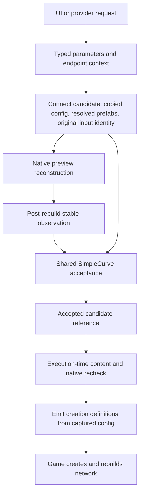

# NT-023 architecture review and Connect acceptance

Implementation checkpoint: October 3, 2026, on `dan/nt-023-architecture-review`, stacked on [NT-021 PR #18](https://github.com/danwayneharris/CS2-NetworkTools/pull/18). The review produced one bounded Connect prerequisite. The linked pure production-helper tests passed **34 assertions**. Parent integration passed the production compile through the Slope suite and all **23/23 Python scripts** after registering Connect in the aggregate inventory. The corrected native road Connect smoke test also passes; ordinary UI review remains pending. See final verification below. Historical NT-021 results do not verify this new gate.

This document implements the review deliverable in [NT-023](plans/NT-023-architecture-review.md). Source links describe current code; before-change descriptions are explicitly historical. Session chronology: [October 3 stage-three note](session-notes/2026-10-03-0650-nt023-architecture-review.md).

## Features and usage

Connect's **Debug SimpleCurve** now requires a completed candidate with current authored inputs, matching native preview observations and no native Error entities before either manual or provider Apply. A request is checked again immediately before emitting Apply definitions. If its content changed, the operation returns to preview instead of applying the stale candidate.

There is no new player option, geometry solver, lane selection, or change to the existing horizontal controls. Complex Curve, Loop and Release keep their existing acceptance envelope. NT-002 must extend the same acceptance contract to Complex before enabling its new profile there.

The provider still supports its established matching-prefab dead-end SimpleCurve envelope. State now includes `rejectionReason`; a successful Apply request remains distinct from permanent native completion. The stricter shared gate is a safety behavior change, not merely a file reorganization.

## Architecture



[ConnectCandidate<TConfig>](../NetworkTools.Mod/Systems/Tools/Connect/Core/ConnectCandidate.cs#L8) stores a value-copy configuration, input identity, revision and submission. It has no ECS/native-container ownership and no lifecycle phase field. Ready-to-Applying changes control flow, not authored content. The tool stores the accepted candidate reference at RequestApply and verifies it is still the submitted candidate before execution.

[Input capture](../NetworkTools.Mod/Systems/Tools/Connect/ConnectToolSystem.Automation.cs#L56) includes selected node identity/components, incident geometry and far nodes, current parameters/validation setting, effective inherited or explicit prefab identity, and prefab NetGeometryData. Missing required components reject safely. Parameter/world changes invalidate evidence and request a fresh preview. A missing-context guard in `ConnectToolSystem.JobMethods.cs:105` prevents a rejected request from immediately scheduling a generator against a vanished endpoint.

[Job scheduling](../NetworkTools.Mod/Systems/Tools/Connect/ConnectToolSystem.JobMethods.cs#L43) accepts the frozen configuration and resolved prefab entities for Apply. SimpleCurve's authored cubic is completely represented by those control values; its deterministic generator is reused. No persistent native candidate buffers were introduced. NT-002 must retain its actual accepted solved profile when that new solver is added, instead of rerunning a potentially different solve at Apply.

[Post-rebuild observation](../NetworkTools.Mod/Systems/Tools/Connect/ConnectToolSystem.Automation.cs#L148) remains scheduled after ModificationEndBarrier via `NetworkToolsMod.cs:72` and `RoadShapeToolSystem.PreviewProbe.cs:121`. Existing completion calls remain. Matching repeated observations are a bounded readiness check, not a universal native completion fence or a directed-lane oracle.

### Native error policy grounded in installed source

Installed `Cities2_Data/Managed/Game.dll` SHA256 `AAEE15C4FA41C130ABAA1183840667E4FAAE531D67E8A9FA7536618EFFA2F86A` matches the separate local decompile's `source-manifest.json` (game 1.6.2f1). Decompiled `Game.Tools.ToolBaseSystem.GetAllowApply` at line 533 permits ignored errors and also consults OriginalDeletedSystem. NetworkTools intentionally hides it with its own public `new GetAllowApply` ([BaseToolSystem.cs:967](../NetworkTools.Mod/Systems/Tools/Base/BaseToolSystem.cs#L967)), which checks the native Error query only. The shared Connect gate reuses that existing NT policy; this stage does not redefine vanilla validation or Anarchy semantics.

RoadShape remains an editing pipeline: immutable original geometry, a transformed candidate, existing-edge preview definitions and direct permanent Curve/Node edits. Connect remains a creation pipeline. Shared math/adapters are selected by actual consumers, not by superficial similarity between their output loops.

## Findings and dispositions

### A1. Connect had different manual/provider acceptance policies

**Disposition: implemented narrowly for Debug SimpleCurve.**

Before this change, manual CanApply checked only Ready/non-None mode and RequestApply checked only Ready. The provider separately required stable current preview evidence; execution rebuilt definitions from current parameters. The risk was accepting a request and later applying inputs different from its preview.

Current source now shares [ControlCandidateAllowsApply](../NetworkTools.Mod/Systems/Tools/Connect/ConnectToolSystem.Automation.cs#L35), [CanApply/TryRequestApply](../NetworkTools.Mod/Systems/Tools/Connect/ConnectToolSystem.Update.cs#L245), and the [execution recheck](../NetworkTools.Mod/Systems/Tools/Connect/ConnectToolSystem.JobMethods.cs#L129). The UI already combines tool readiness with GetAllowApply (`UISystem.Update.cs:137`) and sends button/hotkey requests through `UISystem.Handlers.cs:49`; the Connect gate now also applies that native-error policy to provider requests.

Benefit: one Connect-owned eligibility decision and frozen configuration for the observed SimpleCurve candidate. Risk: stricter Debug SimpleCurve readiness can now reject requests that the former manual path allowed; this is an intentional safety change requiring native/UI verification. Complex/Loop and Release are not silently routed through a SimpleCurve-only policy.

### A2. Endpoint context is inferred and cannot support explicit approach choices yet

**Disposition: design now; implement the minimal context with NT-002 and extend with NT-003.**

`ConnectToolSystem.Lifecycle.cs:21-40` captures node positions and inferred directions. `ComputeNodeDirection` at line 63 uses the first buffer edge for a degree-two node (line 77), chooses continuation for dead ends, and points toward the other endpoint for higher degrees. `ComputeEndNodeDirection:88` correctly distinguishes stored edge ends for its legacy tangent; `ComputeInBetweenNodeDirection:109` deliberately projects perpendicular to a selected through-direction.

Do not replace this legacy behavior globally. Feature-on context needs explicit node/approach-edge entity identities including versions, selected traversal direction, prefab/composition identity, actual curve endpoint, node-center offset and grade. For ambiguous approaches require a user/provider choice. Keep the legacy path when the option is off. NT-003 adds actual lane identity/direction; NT-022 adds correspondence and lateral geometry. No generic context framework is needed before those consumers exist.

### A3. Connect structural elevation fields are never populated

**Disposition: targeted correctness investigation and fixture before profile expansion.**

`Connect/Core/ConnectJobConfig.cs:13,16` declares StartElevation and EndElevation. `ConnectToolSystem.JobMethods.cs:21` still never assigns either. SimpleCurveGenerator lines 38-39, ComplexCurveGenerator lines 57/75, and LoopGenerator lines 123/160/161/177 consume these zero-default fields as structural node-elevation metadata.

This is not equivalent to the world-space Y coordinate, which is present in the authored curve. Verify installed native semantics and an elevated-to-ground/tunnel endpoint fixture before changing it. A useful fix captures actual endpoint Elevation independently from authored Y and includes it in candidate identity. Do not silently change Loop under the guise of the new profile option. This review establishes missing assignments, not a universal visible corruption claim.

### A4. Creation output reuse already exists

**Disposition: already resolved; retain edit/create separation.**

`Systems/Tools/Utils/EdgeConfig.cs` describes identity, geometry, structural elevation, prefab and course flags. `NetCourseEmitter.cs:21` assembles native definitions and has real consumers in Connect (`ConnectToolSystem.Jobs.cs:93`), Generate (`GenerateToolSystem.Jobs.cs:93`) and Parallel (`ParallelToolSystem.Jobs.cs:294`). Connect never directly writes an existing Curve in that output path. RoadShape's permanent output is `RoadShapeToolSystem.Jobs.cs:380` and its existing-edge preview uses its own structural adapter.

A generalized graph-edit framework would merge different identity/topology responsibilities without a concrete benefit. Native creation may legitimately change incident junction reconstruction; existing authored geometry and intended native effects need separate assertions.

### A5. Reuse horizontal stationing math, not an unsuitable complete profile policy

**Disposition: reuse narrowly with NT-002; no speculative solver extraction now.**

`Geometry/VerticalLinearProfile.cs:60` provides dependency-free horizontal arc-length integration. Its Fit method at line 22 chooses a common mean grade and substitutes requested boundary grades into endpoint handles. `Geometry/SectionedVerticalProfile.cs:23` splits that policy at fixed anchors. These are not automatically NT-002's smooth endpoint-height/approach-grade interpolation objective.

`RoadShape/Transforms/CombinedProfileInputs.cs:11` is an editing adapter: it requires matching existing EdgeState identities, uses original node heights and preserves original endpoint offsets. Do not invent existing edges to call it for a new connection. A small Connect adapter can use the same pure length primitive and orientation conventions. The NT-021 bounded junction solver has no present Connect consumer; do not force reuse solely because it is new.

### A6. Complex Curve currently guarantees horizontal, not vertical, midpoint alignment

**Disposition: explicit NT-002 requirement, with a coherent two-curve vertical solve.**

`ConnectToolSystem.cs:MirrorMidControlPoint` mirrors XZ while retaining each control's own Y. Complex generator initialization starts from a single Bezier (`Generators/ComplexCurveGenerator.cs:12`) but output independently emits two curves (`:43`). Preserve the current horizontal handles, then solve Y/grade continuity across the internal join. Test after either inner handle or midpoint moves. Do not interpret the existing G1 comment as a full 3D guarantee.

### A7. Existing Connect regression oracle does not qualify lane choices

**Disposition: retain existing checks; extend with NT-003/022.**

`scripts/exercise-tool-provider.py:156-169` checks graph connectivity, inherited prefab, existing node/edge preservation, and preview/new-edge bijection. `scripts/test-provider-oracles.py:43-89` protects those comparisons against corrupted/missing/duplicate/extra geometry. These are useful and already stronger than the old F06 audit finding.

`ConnectToolSystem.Automation.cs:125` records stable native curves and SubLane identities; stability is not directed-lane correctness. RoadShape `RoadShapeToolSystem.InteriorJunctions.cs:77` compares preserved directed connection sets using actual lane/PathNode data. A new connection legitimately adds connections, so reuse parsing/identity vocabulary rather than its unchanged-set policy. NT-003 must assert intended and forbidden directions. NT-022 must assert ordered selected-lane correspondence and lane positions within tolerance. Vehicle routing remains separate.

### A8. NT-021 provides the needed narrow parameter-domain mechanism

**Disposition: already resolved for scalar domain boundaries; keep future structured validation feature-owned.**

`Systems/Tools/Parameters/Parameter.cs:33-43` applies finite checks and an optional domain predicate before mutation/events. Existing finite handle values outside UI slider metadata remain permitted unless a parameter explicitly opts into a domain. `Systems/UI/UISystem.cs:182-185` rolls rejected float writes back to the accepted binding value. NT-021 validates the complete combined request before mutation in `RoadShapeToolSystem.Automation.cs:ConfigureAutomationCombined`.

Future approach/lane choices are structured identities, not scalar slider bounds. Use one feature-owned validation path shared by provider/UI before committing a request. No global clamping, invented enum restrictions, or general parameter framework redesign is justified.

### A9. Native-container and observer ownership require caution

**Disposition: preserve fences; defer broad concurrency/performance refactoring.**

Connect schedules a borrowed SelectedNodeEntities list (`ConnectToolSystem.Jobs.cs:25`; `JobMethods.cs:66`) that the current job never actually reads. Apply completes before reset (`JobMethods.cs:147`). Debug stop completes m_ControlJob (`Lifecycle.cs:185`), while OnDestroy disposes the list at line 160. This is reason to simplify unused inputs or inspect exact lifecycle guarantees, not evidence of a confirmed native race.

The Debug observer runs after ModificationEndBarrier (`NetworkToolsMod.cs:72`), through `RoadShapeToolSystem.PreviewProbe.cs:121-124`. Preserve this scheduling and current completion calls. Do not move observation into arbitrary provider polling or remove synchronization for cosmetic reasons. Measure before claiming observer caching improves performance.

### A10. Source organization and shared protocol locations

**Disposition: defer mechanical moves.**

ProviderV1 and VectorJsonConverter live under RoadShape while serving Connect too. Moving them is organizational, not a prerequisite for profile/lane behavior. Larger Connect conflicts will concentrate in parameter declarations, endpoint initialization, job config, automation and curve UI. Isolate mechanical moves from behavioral changes and keep Common pinned. The unreachable duplicated combined-schema branch was removed separately during NT-021's codegen correction; no broader protocol churn follows from that removal.

## Testing

Actually run for this prerequisite:

```powershell
dotnet run --project NetworkTools.Connect.Tests
```

Result: **25 assertions passed** against the linked production `ConnectCandidate<TConfig>` source. No game assemblies or production mod compilation are required by this executable. It covers pending producer/dirty input, insufficient or missing observations, changed preview, native errors, unavailable/changed original context, stale revision/submission, uninitialized candidates, deterministic evaluation and copied ownership of accepted handles/prefab versions. Repeated request/execution evaluation accepts unchanged content because lifecycle phase is not content identity.

| Verification category | Status at this checkpoint |
| --- | --- |
| Pure production-helper regression | Passed, 25 assertions |
| Production compilation | Passed through the production Slope suite |
| Aggregate registration / Python inventory | Connect suite registered; 23/23 Python scripts passed |
| Native SimpleCurve preview and permanent Apply | Pending |
| Native mutation between request and execution | Pending |
| Reload, ordinary UI/hotkey, visual review | Pending |
| Vehicle traversal | Not claimed |

The pure helper tests do not prove that every ECS input is captured or that execution is correctly scheduled. Integration must additionally test manual/provider entry points, changed endpoint/version/incident curve after request, prefab/structural changes, missing components, and native observation/error changes. A valid Ready-to-Applying transition with no content edit must still work. Rejection must produce no Apply definitions before requesting a fresh preview.

Before extending acceptance to Complex/Loop, characterize their current emitted geometry and demonstrate parity with features off. Preserve the independent Connect regression checks in `scripts/exercise-tool-provider.py` and adversarial oracles in `scripts/test-provider-oracles.py`. Keep the final aggregate summary with the review artifact and report native results separately.

## Limitations and deferred decisions

- This gate is **Debug SimpleCurve only**. Complex, Loop and Release are not newly qualified. The provider's existing dead-end/matching-prefab restrictions remain.
- Stable native curve/SubLane observations do not prove intended directed lane connections, lateral correspondence, collision freedom, rendered surface quality, or vehicle routing.
- The snapshot is scoped to operation inputs; it is not a city-wide lock or a proof against every concurrent-mod mutation. Preserve the request-to-execution recheck and native-container fences.
- Structural StartElevation/EndElevation population, explicit approach context and Complex vertical continuity remain concrete next-stage work described in A2/A3/A6. They were not silently fixed here.
- Global cross-mod validation-switch ownership and observer optimization need separate design/evidence. No speculative graph-edit framework or Common submodule change was introduced.
- Diagnostics, originals/candidates/native captures, provider access and replay hooks remain. Do not remove useful evidence to make the architecture appear smaller.

## Prior-audit reconciliation

- RoadShape F02/F09 are implemented: cached originals in `PathData.cs:107`, cache/submission/current comparison in `Update.cs:115`, request gate at `Update.cs:183`, and execution recheck at `JobMethods.cs:120`. Connect's separate gap motivated this bounded change.
- F03/F10 affected-edge composition and preservation of Node fields exist. Later bounded native evidence is in [native audit gates](session-notes/2026-10-01-1537-native-audit-gates.md); nonidentity rotation and arbitrary races remain separate.
- F04 arrival-dependent search and F05/F06 enforced suite/Connect comparisons are resolved within their recorded scope. Do not repeat their old defects as current findings.
- F08 now has NT-021's explicit optional parameter predicate. Global UI-metadata clamping remains deliberately rejected because geometry handles have different domains.
- F13 generator diagnostics and F14 actual offline entry point exist. [NT-001 development identity and packaging](development-build-identity.md) supersedes historical absence of an isolated packaging workflow.
- F07 global cross-mod boolean ownership remains deferred; restoring one saved boolean does not solve concurrent ownership/ABA. F11 canonical warm-start ranking is not automatically required. F12 needs measurements; F15 broad formatting/protocol moves are not prerequisites.

## Dan's review

Review branch: `dan/nt-023-architecture-review`, stacked on NT-021 PR #18. No NT-023 deployed artifact hash or native review checkpoint has been recorded at this documentation checkpoint. The previously deployed NT-021 Debug build `7eebfc49830a` is **not** evidence for this source change. A later build/native evidence section must record the exact NT-023 source revision, configuration, hash, baseline and result checkpoint before executable review is described as ready.

1. Read A1 and the architecture map. Confirm that the shared policy is intentionally limited to Debug SimpleCurve and that creation remains separate from RoadShape editing.
2. Review why Phase is excluded from content identity and why the accepted request is checked again before Apply output.
3. Run the isolated helper command above; expect 25 assertions, without deployment or game access.
4. Once an NT-023 review build/checkpoint is supplied, load a disposable matching-prefab dead-end SimpleCurve fixture. Change a handle, wait for native preview readiness, then Apply through the ordinary UI. Expect permanent geometry to correspond to the accepted preview.
5. Follow the recorded stale-input fixture: change endpoint/incident context after acceptance but before execution. Expect rejection and a fresh preview, with no stale permanent creation. Inspect the provider rejection reason and independently compare permanent entities.
6. Review deferred approach/structural-elevation/lane work before NT-002/003/022. Inspect Complex/Loop feature-off behavior separately; they did not acquire the new native evidence contract here.

Expected: clearer ownership and a protected SimpleCurve handoff, not new geometry options or a traffic qualification claim. Ordinary UI, rendered appearance, reload and vehicle review remain pending until actually exercised. Missing native access must be reported explicitly with a reproducible manual fixture recipe.


## Final stage verification

Clean Debug build `b35766a` deployed successfully; all eight offline aggregate
suites passed, including 34 Connect acceptance assertions and 23 Python test scripts.
The first live attempt found idle revision churn before selection: repeated null
input snapshots advanced revision. The correction advances only on an actual
identity transition; null still never licenses Apply. This failure and counterexample
remain in the session history.

The corrected terrain-baseline road Connect test passed: stale revision rejected,
new path connected with inherited prefab, existing node/edge geometry unchanged,
and bijective native preview/permanent cubic correspondence had zero error.
This tests provider execution through the shared gate, not human UI interaction or
all possible native-error/race timings. It does not certify requested lane mapping
or vehicle traversal. [Compact evidence](session-notes/nt023-native-evidence.json).

Review checkpoint: `CitiesIIAgentBridge-review-nt023-road-connect-20261003-140428-816b028b`.

## Dan's manual review — October 3, 2026

Dan confirmed basic Simple Connect behavior appears correct on deployed Debug
`7dfb76ffeb88`. First selection after a fresh game launch can leave Create Connection
disabled; ending-node reselection resolves it, and an in-process save reload does
not reproduce it. This is accepted as a minor non-blocking issue for this PR and
tracked as [BUG-001](BUG-BACKLOG.md). The failed state was not captured by the agent.
More complex cases and vehicle traversal remain pending. Dan authorized squash merge.
