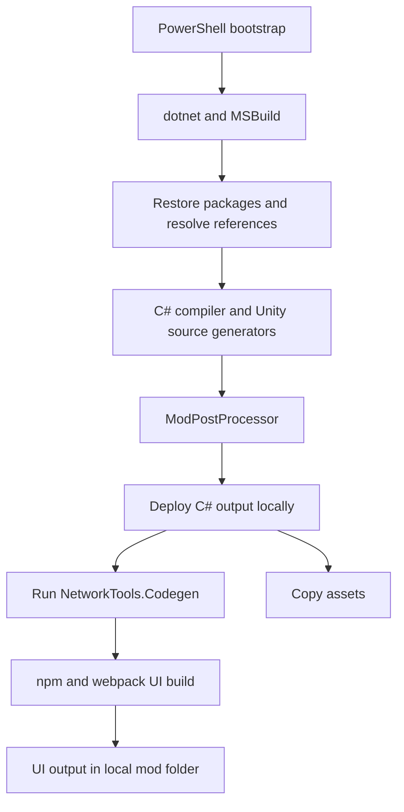

# NetworkTools build system

This guide explains how source becomes a locally installed CS2 mod. For commands,
prerequisite installation, and machine-specific paths, use [the bootstrap guide](../BOOTSTRAP.md).
For behavior inside the running game, see [system architecture](system-architecture.md).

The descriptions below are grounded in this checkout's project files and build
observations. Two full Debug builds now pass: the original mod source, then a build
with a small UI tooltip marker. C# compilation, postprocessing, parameter generation,
webpack, and local deployment succeeded. The deployed UI bundle contains the marker.
Automated test execution, Release builds, and in-game operation remain unverified.

## 1. Tools and their responsibilities

| Tool or file | Responsibility |
| --- | --- |
| [bootstrap.ps1](../scripts/bootstrap.ps1) | Check prerequisites, refresh the shell environment, optionally install dependencies, invoke the build and tests. |
| Git | Retrieve the specific Common submodule revision recorded by this repository. |
| WinGet | Install supported missing Windows tools when `-Install` is supplied. |
| `dotnet` / .NET SDK | Supply the C# compiler, MSBuild, and build/run/test commands. |
| [CS2-NetworkTools.sln](../CS2-NetworkTools.sln) | Group projects and map solution configurations to project configurations. |
| `.csproj` | Define a C# project's framework, source items, references, and custom build behavior. |
| `.props` / `.targets` | Import shared MSBuild configuration and executable targets. These extensions are conventions; both contain MSBuild XML. |
| NuGet | Restore .NET dependencies such as Harmony, PolySharp, Roslyn, and NUnit. |
| Unity ECS source generators | Generate C# implementation during compilation. |
| CS2 ModPostProcessor | Perform the game's required post-compilation processing. |
| Node.js / npm | Run UI tooling, install project-local packages, and invoke UI build scripts. |
| TypeScript / webpack | Compile and bundle the React UI and styles into game-loadable assets. |

The PowerShell script orchestrates setup. Most build behavior already lives in the
project files and imported targets.

## 2. Host tools and target runtimes are different

| Program | Target or runtime | Where it executes |
| --- | --- | --- |
| [NetworkTools.Codegen](../NetworkTools.Codegen/NetworkTools.Codegen.csproj) | .NET 8 | On the developer's machine during the build. |
| [NetworkTools mod](../NetworkTools.Mod/NetworkTools.csproj) | `net48`, referencing game/Unity assemblies | Inside CS2's managed environment. |
| Installed ModPostProcessor | .NET 6, according to its runtime configuration | On the developer's machine after compilation. |
| UI build tooling | Node.js | On the developer's machine. |
| Compiled UI | Game-provided JavaScript/UI environment | Inside the game's UI environment. |

An SDK provides build tools; a runtime executes programs. Installing the .NET 8 SDK
does not automatically satisfy a separate executable's .NET 6 runtime requirement.
Likewise, using a modern compiler does not change the framework targeted by its output.

An embedded-toolchain analogy is useful: the host compiler version and the target
SDK/API surface are separate choices.

## 3. MSBuild evaluation and execution

MSBuild first **evaluates** properties, items, imports, and target definitions.
It then **executes** the requested target and the associated dependency/hook graph.

- Properties are named configuration values, such as `TargetFramework`.
- Items are collections, such as source files, references, or files to copy.
- Targets contain tasks: compile, run a command, copy files, and so on.
- `BeforeTargets` and `AfterTargets` attach work to other targets.

This distinction explains why a missing imported `Mod.props` stops the build
before the compiler runs: project evaluation itself cannot finish.

The mod's [project imports](../NetworkTools.Mod/NetworkTools.csproj#L21) are ordered as follows:

1. `Common/LucaModsCommon.props`: shared packages, assembly references, configurations.
2. CS2 `Mod.props` and `Mod.targets`: game paths, generators, postprocessing, deployment.
3. `Common/LucaModsCommon.targets`: UI, assets, and custom postprocessor configuration.
4. Project-specific settings and targets.

The project reasserts C# 11 and unsafe-code support after the CS2 imports because
those imports reset language settings. Property evaluation order matters, but XML
file order alone does not specify the target execution sequence.

For example, `GenerateParametersTS` uses `BeforeTargets="BuildUI"`, while `BuildUI`
uses `AfterTargets="DeployWIP"`.

## 4. Source and dependency composition

The Common Git submodule contributes C# source, TypeScript helpers, and MSBuild
configuration. Its C# files fall under the mod project's default source inclusion;
the project excludes Common's `bin` and `obj` directories. It is not simply a
runtime reference to a separately built `LucaModsCommon.dll`.

Dependencies reach the compiler through two main mechanisms:

- **Package references:** NuGet restores versioned packages.
- **Assembly references:** MSBuild resolves installed game, Unity, and framework DLLs.

The shared props mark game/Unity references `Private=false`, meaning those references
are not intended to be copied alongside the mod as private dependencies. The game
already supplies them. See [LucaModsCommon.props](../NetworkTools.Mod/Common/LucaModsCommon.props#L39).

Debug defines `IS_DEBUG` and `ENABLE_PROFILER`; Release defines `USE_BURST`. The
road-shaping job conditionally adds `[BurstCompile]` under `USE_BURST`. A successful
Debug build therefore does not establish that the Release/Burst path works.

## 5. Build graph and generated outputs



This shows the main mod pipeline, not a total ordering of every independent
project in the solution.

### C# compilation and Unity processing

The compiler produces `NetworkTools.dll`. Unity source generators participate in
compilation. The installed postprocessor runs afterward using the Unity mod
project and resolved references. Shared targets restrict its platform list to
Windows. See [CustomModPostProcessorConfig](../NetworkTools.Mod/Common/LucaModsCommon.targets#L31).

A compiled DLL alone is not our completion criterion: required postprocessing
must also succeed.

### Parameter code generation

[NetworkTools.Codegen/Program.cs](../NetworkTools.Codegen/Program.cs#L42) parses C#
source using Roslyn syntax trees, an **abstract syntax tree (AST)** representation.
It reads enums and parameter declarations and emits TypeScript containing:

- Enum definitions and option metadata.
- Parameter keys, defaults, ranges, and mode information.
- UI binding declarations and lookup tables.

This is a standalone build-time program, distinct from Unity's compiler source
generators. It parses source rather than executing the mod. It writes the generated
file only when its content changes.

The project's [GenerateParametersTS target](../NetworkTools.Mod/NetworkTools.csproj#L61)
runs it before the UI build. The output is
`NetworkTools.Mod/UI/src/generated/parameters.generated.ts`, which is ignored by Git.

### UI build

The shared target runs `npm run build` in `NetworkTools.Mod/UI`. Its existing npm
`prebuild` hook runs `npm install --no-audit --no-fund`, then webpack runs.
This is the upstream behavior; it is not yet a lockfile-enforced `npm ci` workflow.

[webpack.config.js](../NetworkTools.Mod/UI/webpack.config.js#L32) configures:

- TypeScript/TSX compilation through `ts-loader`.
- Sass/CSS processing and CSS extraction.
- Asset handling and JavaScript optimization.
- Resolution of shared UI helpers from `Common/ui`.
- Output into the local `Mods/NetworkTools` directory.

React, ReactDOM, and `cs2/*` APIs are **externals** supplied by the game at runtime.
React packages remain project-local development dependencies; there is no global
React installation step.

### Deployment, tests, and publishing

CS2's `DeployWIP` target replaces the local development mod directory and copies
the C# outputs. UI generation/build and asset copying hook into this stage.
Close the game before building and preserve any manual edits in that output folder.

`bootstrap.ps1 -Test` builds and then invokes the existing test project with
`--no-build --no-restore`. The presence of a test project is not evidence that useful
tests were discovered or passed; test discovery and execution remain unverified.

Publishing uses separate targets and publishing configuration. Our bootstrap calls
`build`, not `publish`, and does not upload to Paradox Mods.

## 6. Environment ownership

The C# project explicitly reads persistent **User-scoped** Windows `CSII_*`
environment settings. The UI reads its inherited process environment instead.

The bootstrap refreshes PATH and copies the user-level CSII settings into the
current process. This normally avoids a terminal restart. It does not replace the
persistent toolchain settings with hardcoded paths.

Run as the Windows user who installed the toolchain. A sandbox account can have
different user settings even when it can read the same repository.

See [BOOTSTRAP.md](../BOOTSTRAP.md#environment-and-installation-locations) for actual
locations and PowerShell examples.

## 7. What the initial failures taught us

| Failure | Cause established by inspection | Resolution or status |
| --- | --- | --- |
| `dotnet` not found | SDK unavailable to the shell; standard install locations initially absent. | Installed .NET SDK 8.0.425; bootstrap refreshes PATH. |
| `MSB4019`, missing `Mod.props` | User-level `CSII_TOOLPATH` was unset before toolchain installation. | Completed the in-game toolchain setup. |
| `NU1100` for multiple packages | `dotnet nuget list source` reported no sources. | Pass nuget.org explicitly to the build. |
| Missing `ReadOnlySpan<T>` and `KeyValuePair.Deconstruct` | Resolved references selected stock net48 `mscorlib.dll` from NuGet instead of the game's core library. | Select the game's framework directory and explicitly reference `netstandard`. |
| Missing `netstandard, Version=2.1.0.0` after the first override | Changing the framework directory alone left the required reference incomplete. | Add `AdditionalExplicitAssemblyReferences=netstandard`. |
| Postprocessor could not start: missing runtime | Its requested .NET 6 runtime was missing; .NET 8 was installed. | Installed and verified runtime 6.0.36. |
| Postprocessor could not load its DLL: `0x800711C7` | Windows CodeIntegrity events 3033/3077 reported an enforced signing-policy block on the unsigned tool DLL. | The user turned Smart App Control off; the subsequent full build passed. No policy changes made by the bootstrap. |

The working compilation overrides are:

```powershell
$managed = [Environment]::GetEnvironmentVariable('CSII_MANAGEDPATH', 'User')
dotnet build CS2-NetworkTools.sln --configuration Debug `
    --source https://api.nuget.org/v3/index.json `
    "-p:FrameworkPathOverride=$managed" `
    -p:AdditionalExplicitAssemblyReferences=netstandard
```

These resolved the compiler failures without changing mod or Common source.
The bootstrap supplies these arguments and the environment refresh.

The key distinction is **language support versus library API availability**. C# 11
can understand dictionary-entry deconstruction syntax, but the referenced library
must provide an appropriate `Deconstruct` method. Likewise, game APIs can require
types absent from the stock framework reference set.

### Windows Application Control blocker

The full build retry reached the postprocessor but Windows refused to load
`Cities2_Data/Content/Game/.ModdingToolchain/ModPostProcessor/ModPostProcessor.dll`.
The file is unsigned and has no `Zone.Identifier` download marker. This is an OS
code-integrity block, not a PowerShell execution-policy issue or missing runtime.

Inspect **Windows Security > App & browser control > Smart App Control** and
**Event Viewer > Applications and Services Logs > Microsoft > Windows >
CodeIntegrity > Operational**. Do not bypass postprocessing and treat the DLL as
ready for in-game use.

[Microsoft's Smart App Control FAQ](https://support.microsoft.com/en-us/windows/security/threat-malware-protection/smart-app-control-frequently-asked-questions)
documents that there is no individual-app exception. Any decision to disable this
protection affects the PC, not only this repository, and belongs to the user.
The bootstrap does not change security policies.

### Successful Debug builds and remaining warnings

The original-source baseline completed in about 38 seconds, including first-time
npm installation. The UI-marker rebuild completed in about 9 seconds. Both emitted
two MSBuild warnings because the solution-wide `netstandard` override also reaches
the .NET 8 code generator; scoping this override to net48 projects remains cleanup
work. Webpack also emitted three warnings; these did not fail either build.

The upstream npm `prebuild` step rewrote `package-lock.json`. That incidental change
was reverted after verification; no dependency update was intended. Future builds
may rewrite it again until we establish a reproducible npm installation policy.

The current smoke-test marker appends `[Dan local]` to the Network Tools button
tooltip in game and editor views. See [the smoke-test procedure](../BOOTSTRAP.md#in-game-smoke-test-after-a-successful-build).

## 8. Updating this guide

Update this document when imports, reference resolution, generation, deployment,
or toolchain requirements change. Keep operational commands in `BOOTSTRAP.md` and
the script; keep runtime behavior in the architecture guide. Record actual successful
stages rather than inferring build or runtime success from prerequisite checks.
