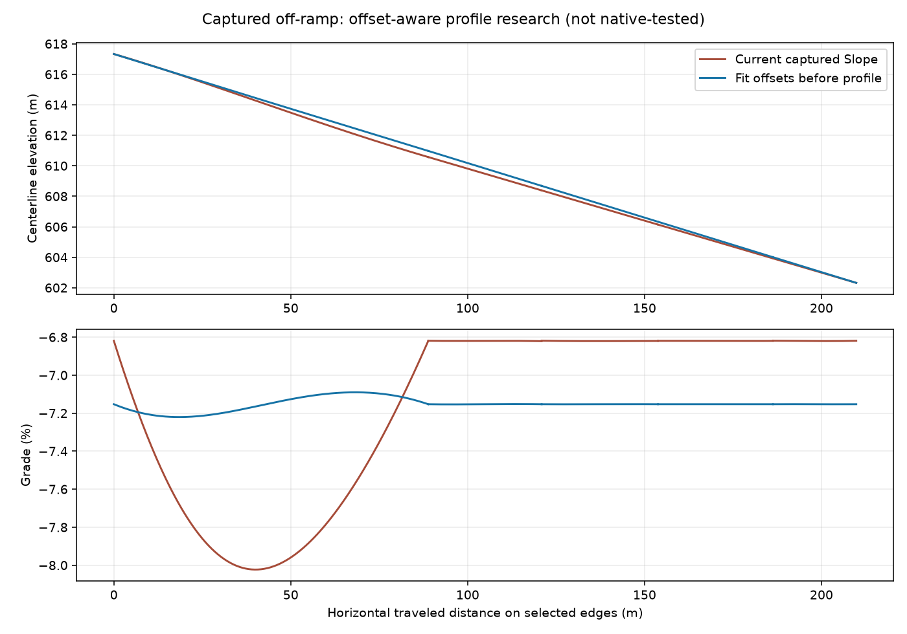

# Offset-aware profile research — 2026-10-01 03:30

The retained five-edge off-ramp counterexample is now reproduced by
scripts/explore-vertical-profile.py. It compares captured Slope output with a
candidate that fits endpoint/node offsets before constructing vertical handles.
The candidate changes the worst grade from -8.02306% to -7.22046%, versus a nominal
-7.15288%. All join endpoint grades agree in double precision. This is offline,
not yet native-tested, and does not establish a terrain/rendering fix.

## Model

For edge i, preserve its original offsets a_i and d_i from its endpoint nodes.
Use horizontal arc length L_i, not the input curve's 3D length. With fixed outer
node heights H_0 and H_n, solve

    g = (H_n - H_0 + sum(d_i - a_i)) / sum(L_i)
    H_(i+1) = H_i + g L_i + a_i - d_i

Curve endpoints are H_i+a_i and H_(i+1)+d_i. Vertical handles use the endpoint
horizontal handle distances times grade g. Thus every selected edge has the same
mean grade and matching endpoint grades; no post-fit endpoint shift is necessary.
Junction spans retain their existing endpoint-offset differences, rather than
pretending those spans can satisfy an arbitrary constant grade too. Boundary
smoothing explicitly substitutes the neighboring endpoint grade and therefore
can create a nonconstant first/last segment. This limitation must remain visible.

A cubic vertical coordinate cannot generally represent arc-length-linear height
on an arbitrary curved horizontal cubic. Residual interior grade variation is
measured, not called perfectly constant. No extra segments or topology edits.

## Implementation checkpoint

VerticalLinearProfile is a pure, allocation-free numerical module with caller-owned
buffers. It rejects nonfinite/degenerate data and bounded quadrature that fails to
converge. It is not wired into the game yet. The geometry executable passes all
existing checks and 338 new analytic assertions plus invalid-input checks: unequal
lengths, short/long adjacency, reversed traversal, nonzero offsets, translated
heights, rise/fall/flat outer endpoints, individual/together boundary grades,
straight/curved analytic lengths and degeneracy. Those tests do not certify native
node alignment, lane preservation, terrain, rendered surfaces or traversal.

Raw experiment: artifacts/offset-fit-experiment. Production Slope is still unchanged.
Next integrate through the shared Preview/Apply path, retaining native guards, and
replay the exact toy scenarios before considering deployment a successful fix.