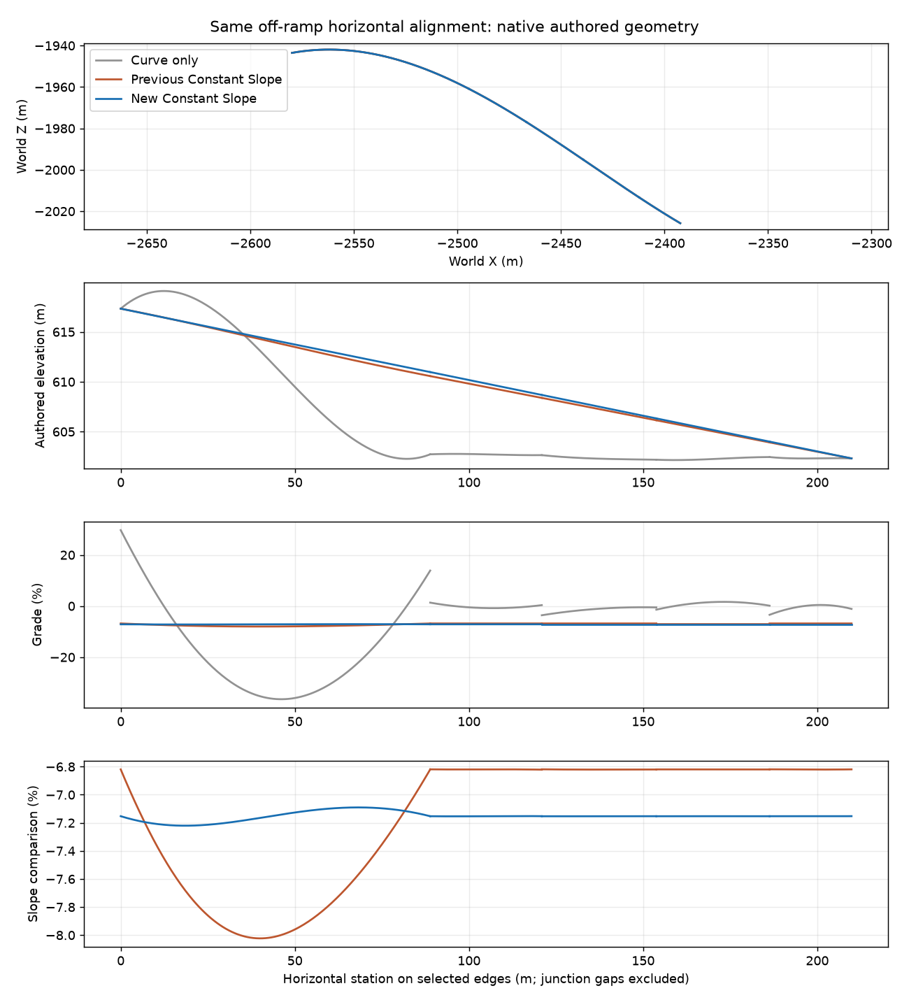

# Native off-ramp replay and boundary counterexamples

The five-edge off-ramp-only fixture starts at the highway junction
(X -2573.07715, Y 617.3303, Z -1939.87915) and ends at the existing ramp dead end.
Curve strength 1 then Constant Slope, boundary smoothing off, passes independent
native/permanent, topology, fixed endpoint, directed connection and physical lane
mapping checks. No unselected edge changed in this selection.

Historical and new entity IDs differ. Matching complete horizontal control-point
geometry rather than IDs established **exactly identical XZ controls** to the
retained earlier counterexample. A failed first attempt to match by entity ID was
an analysis error, not missing geometry; the reusable plotter matches by XZ with a
1 mm maximum and rejects ambiguous reuse. No native state was changed by analysis.

The new maximum sampled grade magnitude is 7.220388%, compared with the historical
8.02303% dip. The nominal profile grade is -7.152878%. Maximum join endpoint-grade
difference is 0.000559 percentage points. The independent Python prediction differs
from native controls by at most 0.0421 mm.

A small retained native numerical fixture now runs through the actual C# pure
module as a repeatable regression: maximum error 0.0421 mm, required <=1 mm.
The full geometry suite passes, including 605 analytic assertions and invalid-input
checks. Reversal now covers both boundary-grade overrides, including individual
and combined switches. A conflicting boundary derivative test explicitly verifies
that the interior grade must compensate to retain fixed endpoint elevations.

Slope-first then Curve on the seven-edge highway/ramp fixture also passes native
connection/geometry guards, but increases maximum sampled absolute grade from
2.38353% to 2.90927%. This demonstrates operation-order sensitivity still exists;
Curve's elevation-preserving contract is unchanged. These figures do not establish
visual terrain quality or vehicle traversal.

Raw evidence: ignored `artifacts/profile-offramp-only` and
`artifacts/profile-slope-curve-ramp`. The focused fixture and plot/replay scripts are
tracked; raw requests/polling files are not. Other terrain cases are running next.
`git add` correctly refused the ignored captures directory. The compact numeric fixture was moved to `NetworkTools.Geometry.Tests/Fixtures/` and explicitly copied into test output; raw-capture exclusions remain intact.
