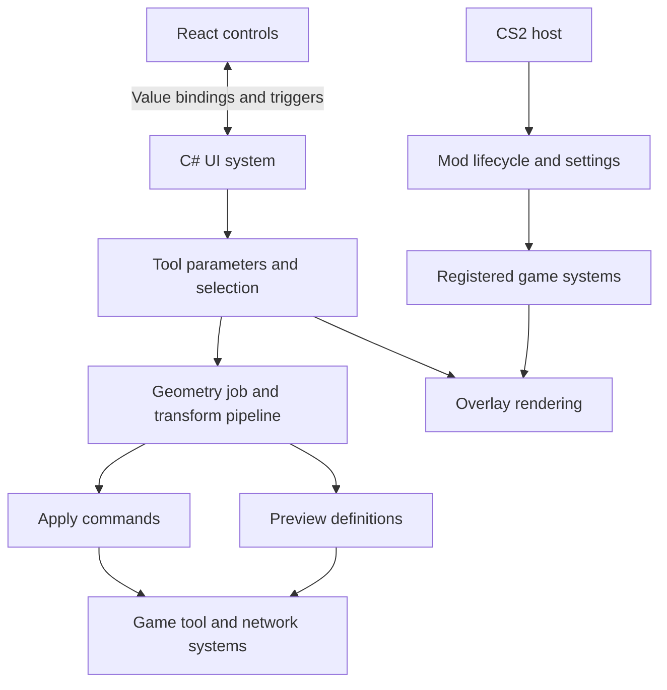
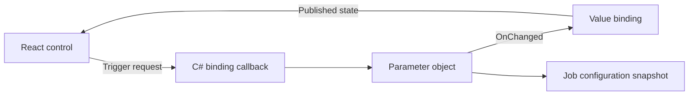

# NetworkTools system architecture

Current checkpoint (Sept 29): ordinary split constraints and Debug-only interior
junction section fitting are implemented. Native preview and independent Apply
captures cover rail, road and highway cases; two rail cases retain strict failures
for millimeter-scale native node-center drift. See [split points](split-points.md),
[interior junctions](interior-junctions.md), and the
[sprint report](session-notes/2026-09-29-sprint-report.md). Release/Burst for these
additions and vehicle routing remain unverified. Earlier dated claims below are
historical baselines, not verification of the new features.

This is a living map of the runtime architecture, grounded in the current checkout.
For how the package is produced, see [build system](build-system.md); for setup
commands, see [BOOTSTRAP.md](../BOOTSTRAP.md).

This guide is for contributors familiar with programming who are new to this mod
or Unity's Entity Component System (ECS). For a focused source-reading path, follow
**parameter declaration → UI binding → job configuration → transformation →
preview/apply** through sections 6–9.

**Status and limitations (Sept 26, 2026):** the architecture below follows the mod's
source. Debug builds and local deployment pass; an in-game smoke test confirmed the
modified tooltip and a successful Connect operation joining two road segments.
Other tools, automated tests, and Release/Burst behavior remain unverified in this
fork. The game's loader internals have not been audited. Section 10 describes the
existing Smooth Curve infrastructure; proposed work lives in the separate
[Smooth Curve plan](smooth-curve-plan.md).

## 1. A code mod is a hosted plugin

NetworkTools has two executable parts: a managed C# assembly hosted by the game and
a React/JavaScript UI hosted by the game's UI environment. Assets and localization
accompany them. They communicate through the game's binding API.

This resembles an audio plugin's processing implementation and editor UI: related
parts with different responsibilities and execution environments.

Mods need not all have this structure. Data/asset mods can primarily contribute
content; code mods can register behavior without a custom UI.



## 2. Repository map

| Area | Responsibility |
| --- | --- |
| [NetworkToolsMod.cs](../NetworkTools.Mod/NetworkToolsMod.cs) | Mod identity, settings factory, system registration. |
| [Common](../NetworkTools.Mod/Common) | Shared lifecycle, bindings, logging, rendering, UI helpers, and build configuration; a pinned Git submodule. |
| [Components](../NetworkTools.Mod/Components) | ECS data for selection, eligibility, metadata, tools, and handles. |
| [Systems/Tools](../NetworkTools.Mod/Systems/Tools) | Interactive tools and reusable selection/parameter/handle infrastructure. |
| [Systems/UI](../NetworkTools.Mod/Systems/UI) | Bridge between game/tool state and React. |
| [Systems/Rendering](../NetworkTools.Mod/Systems/Rendering) | Selections, handles, previews, and other world overlays. |
| [Systems/Tooltips](../NetworkTools.Mod/Systems/Tooltips) | Tooltips and action hints. |
| [Settings](../NetworkTools.Mod/Settings) and [L10n](../NetworkTools.Mod/L10n) | Preferences, input bindings, and localized strings. |
| [UI/src](../NetworkTools.Mod/UI/src) | React components, hooks, and game bindings. |
| [NetworkTools.Codegen](../NetworkTools.Codegen) | Build-time C# metadata to TypeScript generator; not game runtime code. |

Files such as `.Lifecycle.cs`, `.Jobs.cs`, and `.JobMethods.cs` are **partial class**
organization. They compile into the same type; they are not separate services.

## 3. Mod lifecycle and scheduling

[NetworkToolsMod](../NetworkTools.Mod/NetworkToolsMod.cs#L32) implements `IMod` and
inherits `LucaModBase<NetworkToolsMod>`. The inherited
[OnLoad](../NetworkTools.Mod/Common/Mod/LucaModBase.cs#L185) initializes logging,
settings, localization, saved preferences, key bindings, Harmony infrastructure,
systems, and UI asset hosting. Disposal unregisters settings and removes this
mod's Harmony patches.

This is the **Template Method pattern**: the base class owns the sequence; the mod
overrides steps such as `CreateSettings` and `RegisterSystems`.

Harmony supports patching existing managed methods. This checkout contains shared
patch infrastructure, but the initial source review found no patch declarations.
The principal extension mechanism here is system registration.

The [registration list](../NetworkTools.Mod/NetworkToolsMod.cs#L55) assigns systems
to phases of the game's update loop:

| Phase | Registered responsibilities |
| --- | --- |
| `PrefabUpdate` | Create tool prefabs. |
| `ToolUpdate` | RoadShape, AddNode, RemoveNode, SuperNode, SlideNode, Connect, Parallel, Generate, and prefab-cache tools. |
| `UIUpdate` / `UITooltip` | Bindings, prefab selection UI, and tooltips. |
| `Rendering` | Tool overlays and shared custom overlay rendering. |
| `Modification4` | Runtime network postprocessing. |

`NT_PostProcessingSystem` is a runtime ECS system. It is unrelated to the build-time
`ModPostProcessor.exe`.

## 4. ECS: identity, data, and behavior

The mod uses the game's **Entity Component System (ECS)** interfaces:

- An **entity** identifies an object in the world.
- A **component** holds a particular kind of data attached to an entity.
- A **system** queries and processes entities with relevant components.

A road edge can expose connectivity (`Edge`), geometry (`Curve`), its network
definition (`PrefabRef`), and mod-specific selection state (`NT_Selected`).
[NT_Selected](../NetworkTools.Mod/Components/NT_Selected.cs#L15), for example,
contains a path index and rendering options as an `IComponentData` struct.

This is **data-oriented design**: process explicit collections of data rather than
requiring every world object to own a large behavior hierarchy.

A **prefab** is a reusable definition/template, distinct from a particular instance
in the city. This mod also creates tool prefabs. The UI's
[HandleSelectTool](../NetworkTools.Mod/Systems/UI/UISystem.Handlers.cs#L18) resolves
one and asks the game `ToolSystem` to activate it.

## 5. Reusable tool framework

The road-shaping tool builds on this hierarchy:

```text
Game.ToolBaseSystem
  NT_BaseToolSystem
    NT_PathSelectionToolSystem
      NT_RoadShapeToolSystem
```

| Layer | Responsibility |
| --- | --- |
| Base tool | Lifecycle, common options, parameter and handle infrastructure, validation controls. |
| Path selection | Connected path selection, extension/trimming, and selection callbacks. |
| RoadShape | Cache path geometry, configure transformations, schedule preview/apply work. |

RoadShape responds to `OnPathReady`, `OnPathExtended`, and `OnPathTrimmed` by
refreshing path data and handles. Clearing selection destroys handles and invalidates
cached data. See [RoadShape callbacks](../NetworkTools.Mod/Systems/Tools/RoadShape/RoadShapeToolSystem.cs#L63).

The base tool defines an explicit **state machine** with `Idle`, `Configuring`,
`Ready`, and `Applying` phases. A separate `ApplyState` describes what the UI should
show: hidden, insufficient selection, disabled, or enabled. These concepts are
related but are not interchangeable.

## 6. Parameters, handles, and the UI bridge

[RoadShape parameters](../NetworkTools.Mod/Systems/Tools/RoadShape/RoadShapeToolSystem.cs#L24)
describe keys, defaults, ranges, display units, applicable modes, and optional
world-space handle specifications. Parameters therefore form a declarative model,
not just a bag of primitive values.

That model serves two paths:

1. Build-time code generation emits TypeScript metadata and bindings.
2. Runtime registration connects parameter values to C# UI bindings.

[RegisterParameterBinding](../NetworkTools.Mod/Systems/UI/UISystem.cs#L170) installs
callbacks that set parameters and `OnChanged` handlers that publish updated values.
This is **observer/event notification** layered over declarative metadata.



The shared [CommonUISystemBase](../NetworkTools.Mod/Common/Systems/CommonUISystemBase.cs)
creates bindings and triggers under the mod's namespace. JavaScript
[TwoWayBinding.set](../NetworkTools.Mod/Common/ui/utils/bidirectionalBinding.ts#L27)
sends a trigger; it does not directly mutate shared C# memory.

The [UI entry point](../NetworkTools.Mod/UI/src/index.tsx#L11) registers components
in game UI slots including `GameTopLeft` and `Editor`. Other state and commands,
including selection and apply requests, live in [gameBindings.ts](../NetworkTools.Mod/UI/src/gameBindings.ts#L98).

World-space handles provide another way to edit tool parameters. Their management
and dependency propagation live in the base tool's `.Handles.cs` and `.Parameters.cs`
partials. UI edits and handle edits should converge on the same parameter state.

## 7. The boundary between managed controls and geometry jobs

[BuildJobConfig](../NetworkTools.Mod/Systems/Tools/RoadShape/RoadShapeToolSystem.cs#L91)
copies current parameter values into `ShapeJobConfig`. The scheduled job receives
that snapshot alongside cached path geometry and read-only ECS lookups.

This separates the **control plane** (interactive objects, events, preferences)
from the processing data. The job works from a snapshot; Unity job dependencies
coordinate when that work can run and when its results can be consumed.

[SchedulePathTransformJob](../NetworkTools.Mod/Systems/Tools/RoadShape/RoadShapeToolSystem.JobMethods.cs#L23)
schedules `ShapeTransformJob` after an input `JobHandle`, supplies an
`EntityCommandBuffer`, and registers the resulting handle with the barrier.

- A `JobHandle` expresses dependency/completion relationships.
- An **EntityCommandBuffer (ECB)** records changes for later playback.
- The barrier tracks the producing job so playback can respect its completion.

An ECB is not automatically an undo stack or an atomic transaction.

The shape job is an `IJob`, with a sequential edge loop inside it. Scheduling a job
does not imply per-edge parallelism. Its `[BurstCompile]` attribute is conditional
on `USE_BURST`, enabled by the shared Release configuration.

## 8. Geometry representation and transformation pipeline

| Data type | Role |
| --- | --- |
| [EdgeState](../NetworkTools.Mod/Systems/Tools/RoadShape/Core/EdgeState.cs) | Edge identity, path direction, composition, mutable Bézier geometry, and original geometry data. |
| [NodeState](../NetworkTools.Mod/Systems/Tools/RoadShape/Core/NodeState.cs) | Node identity, original position, and transformed position. |
| [ShapeTransformContext](../NetworkTools.Mod/Systems/Tools/RoadShape/Core/ShapeTransformContext.cs) | Path-level geometry, total length, endpoint information, and slope boundary data. |
| [ShapeJobConfig](../NetworkTools.Mod/Systems/Tools/RoadShape/Core/ShapeJobConfig.cs) | User-selected transformation settings. |

An edge's stored direction may oppose traversal direction; `IsForward` records
that distinction. Algorithms must not assume every edge points along the selected path.

A node position represents an intersection center; Bézier endpoints can be offset
from it. Treating them as identical would lose geometric information.

[TransformPipeline.Execute<T>](../NetworkTools.Mod/Systems/Tools/RoadShape/Core/TransformPipeline.cs#L11)
uses a struct implementing [IPathTransformation](../NetworkTools.Mod/Systems/Tools/RoadShape/Core/IPathTransformation.cs#L18):

```text
PreProcess(all edges)
  Process(each edge)
  PostProcess(all edges)
  ComputeNodePositions
```

This is a **Strategy pattern** inside a common pipeline. The generic struct design
is intended for job/Burst compatibility.

The generic pipeline's node-position policy keeps the path's first and last nodes fixed. Interior
positions use the average displacement contributed by adjacent transformed edge
endpoints. That is implemented policy, not a guarantee of tangent or curvature continuity.

## 9. Preview and apply are different output mechanisms

[ShapeTransformJob.Execute](../NetworkTools.Mod/Systems/Tools/RoadShape/RoadShapeToolSystem.Jobs.cs#L44)
copies cached input into mutable arrays, runs the selected transformation, then
chooses an output path:

| Mode | Output |
| --- | --- |
| Preview | Temporary `CreationDefinition` / `NetCourse` entities, plus preview metadata. |
| Apply | Commands changing existing `Curve` and `Node` components and updating connected geometry. |

The [apply implementation](../NetworkTools.Mod/Systems/Tools/RoadShape/RoadShapeToolSystem.Jobs.cs#L420)
recomputes curve lengths, moves nodes, adjusts connected edges outside the selection,
and marks affected entities with update components. Connected-edge adjustment moves
the endpoint and adjacent control point by the node displacement, preserving their
relative offset for that operation.

The same transformation feeds both modes, but their integration with the game differs.
Preview success does not prove commit correctness. Both paths require validation.

## 10. Smooth Curve: current infrastructure

What exists:

- A `CurveSmooth` mode and smoothing-factor parameter.
- A dispatch branch selecting `CurveSmoothTransform`.
- A common path-selection, parameter, preview, and apply framework.

The mode is enabled in metadata on the integration branch.
[CurveSmoothTransform](../NetworkTools.Mod/Systems/Tools/RoadShape/Transforms/CurveSmoothTransform.cs)
calls the independent `PlanarPathTarget` single-boundary-cubic reconstruction and publishes its
candidate arrays only if the whole selection passes validation. It bypasses the
generic transform pipeline's node-position averaging. Endpoints and junctions are
fixed at selection boundaries. The Debug interior-junction path now partitions
the selection using PlanarJunctionTarget and accepts candidates only after exact
native connection-set validation. Release retains interior-junction rejection. Node and control-point elevations are preserved. Interior endpoints,
nodes, and handles blend toward exact subcurves of a shared target by strength;
partial strength does not guarantee matching tangent directions. The first
in-game trials exposed a zero-to-positive handle jump; the follow-up blend change
was confirmed by the maintainer to remove that jump. The current target-based
version also smooths heavily distorted test paths and real-city elevated rail.
The final real-city screenshot sequence shows Apply visually matching preview.
See the [session record](session-notes/2026-09-26-1806.md).

A native result flag is read only after the producing job completes. Invalid fits
produce no preview, disable Apply, and provide a hint to change strength or selection.
Selection mutations, cache refresh, and disposal wait for the prior shape job;
Apply finishes recording commands before resetting the selection lists it reads.

Prototype scope, geometry requirements, and future directions are maintained in the
[Smooth Curve plan](smooth-curve-plan.md).

The [curve geometry module](curve-geometry.md) supplies target construction and
exact cubic subdivision; the earlier node fitter remains available but unused by
Smooth Curve. External tests and full Debug/Release
builds pass, including postprocessing, UI generation/build, and Windows Burst
compilation. Debug is deployed and visually tested. Train traversal, save/reload,
and Release execution remain unverified.

## 11. Anarchy and compatibility boundaries

The development branch adds explicit split constraints and a live regression
harness. See [split-point implementation and limits](split-points.md) and
[regression runner](live-regression-runner.md); these additions have captured native preview/Apply checks documented in those
guides. They do not establish Release compatibility or vehicle routing.

The code's [RefreshAnarchy](../NetworkTools.Mod/Systems/Tools/Base/BaseToolSystem.cs#L878)
toggles the game's validation system for tools that support it. This built-in option
is distinct from integration with the separately installed Anarchy mod.

Supporting networks built with Anarchy requires inspecting the topology and geometry
we actually receive, then testing representative cases with the intended geometry
constraints, even when game validation is disabled.

## 12. Keeping this document useful

The current Debug-only [interior-junction prototype](interior-junctions.md) fits
separate sections around fixed junction attachments and gates Apply on native
connection preservation. Its verification status is tracked separately from the
ordinary [split-point implementation](split-points.md).

When exploring or changing a subsystem:

1. Update the relevant responsibility and data-flow description, with source links.
2. Distinguish observed implementation from proposed behavior and inferred intent.
3. Record assumptions that affect correctness, especially geometry and job lifetimes.
4. Update verification status when builds, tests, or in-game checks actually run.
5. Move resolved questions into the main description rather than accumulating stale notes.

### Open questions and verification work

The Debug Smooth Curve trace now includes explicit rejection reasons and topology
context. See [junction diagnostics](junction-diagnostics.md) for its schema,
offline replay commands, bridge review, and limits of the captured evidence.

- Verify automated test discovery and execution, and extend in-game checks beyond
  the successful tooltip and Connect smoke test.
- Verify Release/Burst behavior separately from Debug compilation.
- Audit path extraction, cached geometry lifetime, and selection invalidation in detail.
- Check preview/apply consistency and propagation into game network updates.
- Inspect actual Anarchy-created networks and the relevant installed game/mod APIs.

### Interior preview search latency (September 30)

Debug interior-junction search now reuses a prior accepted angle as a hint when
original inputs and ordered selection/split flags match. Every new revision still
passes native validation. Stable complete mismatches advance after three equal
observations; missing data retains conservative rejection. The first native search
remains visible, and warm starts can retain a larger angle than a cold search at
the same strength. See [interior junctions](interior-junctions.md) for measured
latency, acceptance details and the outstanding strict node-center drift failure.

### Slope endpoint fitting (October 1)

Slope's end-handle station is measured backwards from that handle's own endpoint,
not by distance from the curve start. After fitting the vertical profile and
averaging interior node displacements, it preserves the original endpoint/node
height offsets at the new node heights. Adjacent handles translate by the same
vertical delta, retaining their fitted endpoint grade. Both Preview and Apply
consume this corrected geometry. Curve Smooth does not use this alignment step.

This resolves the captured off-ramp discrepancy where native reconstruction
replaced two different requested heights with a common junction height. Slope
still moves interior junctions and adjusts unselected incident edges at those
nodes; it does not avoid terrain or guarantee acceptable grades. Directed lane
connections survived the tested off-ramp operation, but appearance and vehicle
traversal remain separate checks. See the [session evidence](session-notes/2026-10-01-0820-selected-fixes-slope.md).

Connect and Parallel now default to **Same as selected**. An explicit asset choice
still overrides that behavior. Parallel inherits each source edge's prefab;
Connect uses its first selected node's prefab. Other non-nullable pickers prefer
the last network selected in the game, then a prioritized road fallback.
